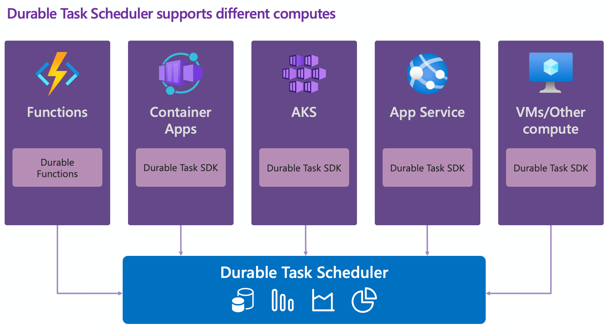

# Azure Durable Task

**Build reliable, fault-tolerant workflows that survive any failure.**

[](./LICENSE.md)
[](https://aka.ms/dts-documentation)

---

## Table of Contents

- [What is Durable Execution?](#what-is-durable-execution)
- [Why Durable Task Scheduler?](#why-durable-task-scheduler)
- [Get Started in 5 Minutes](#-get-started-in-5-minutes)
- [Choose Your Framework](#choose-your-framework)
- [Samples](#samples)
- [Observability](#observability)
- [API Reference](#api-reference)
- [AI-Assisted Development](#ai-assisted-development)
- [Contributing](#contributing)
- [Community & Support](#community--support)

---

## What is Durable Execution?

[Durable execution](https://learn.microsoft.com/azure/azure-functions/durable/durable-task-scheduler/durable-task-scheduler) is a fault-tolerant approach to running code that handles failures and interruptions through automatic retries and state persistence. Your orchestration logic is checkpointed at every step, so if a process crashes or a VM reboots, execution resumes exactly where it left off. Common use cases include distributed transactions, multi-agent AI orchestration, data processing pipelines, and infrastructure management. Paired with a developer framework like [Durable Functions](https://learn.microsoft.com/azure/azure-functions/durable/durable-functions-overview) or the Durable Task SDKs, the scheduler lets you author stateful apps on any compute without architecting for fault tolerance yourself.

---

## Why Durable Task Scheduler?

- 🏗️ **Fully managed** — no storage accounts to configure, no infrastructure to maintain
- ⚡ **Purpose-built & fast** — optimized compute+memory; push-model gRPC streaming (no polling)
- 📊 **Built-in dashboard** — monitor orchestrations, drill into history, pause/terminate/restart instances ([Learn more](https://learn.microsoft.com/azure/azure-functions/durable/durable-task-scheduler/durable-task-scheduler-dashboard))
- 🛡️ **Fault isolation** — runs as a separate Azure resource; failures don't cascade to your app
- 📈 **Independent scaling** — scheduler scales separately from your app; multiple apps can share one scheduler
- 🗂️ **Multiple task hubs** — isolate workloads by environment, team, or project ([Learn more](https://learn.microsoft.com/azure/azure-functions/durable/durable-task-scheduler/durable-task-scheduler#multiple-task-hubs))
- 🐳 **Emulator for local dev** — Docker-based emulator with dashboard included, zero Azure dependency
- 🔐 **Identity-based auth** — Microsoft Entra ID / managed identity, no secrets in connection strings ([Learn more](https://learn.microsoft.com/azure/azure-functions/durable/durable-task-scheduler/durable-task-scheduler-identity))
- 🌍 **Run anywhere** — Azure Functions, Container Apps, AKS, App Service, VMs



---

## ⚡ Get Started in 5 Minutes

### Step 1: Start the emulator

```bash
docker pull mcr.microsoft.com/dts/dts-emulator:latest
docker run -d -p 8080:8080 -p 8082:8082 mcr.microsoft.com/dts/dts-emulator:latest
```

### Step 2: Pick your language and run a sample

| Language | Quickstart Sample | Run Command |
|----------|-------------------|-------------|
| .NET | Function Chaining | `cd samples/durable-task-sdks/dotnet/FunctionChaining/Worker && dotnet run` |
| Python | Function Chaining | `cd samples/durable-task-sdks/python/function-chaining && pip install -r requirements.txt && python worker.py` |
| Java | Function Chaining | `cd samples/durable-task-sdks/java/function-chaining && ./gradlew runChainingPattern` |

### Step 3: Open the dashboard

Navigate to **[http://localhost:8082](http://localhost:8082)** to view orchestration status, history, and more.

---

## Choose Your Framework

| | Durable Functions | Durable Task SDKs |
|---|---|---|
| **Best for** | Serverless event-driven apps | Any compute (containers, VMs, etc.) |
| **Hosting** | Azure Functions | Any host (ACA, AKS, App Service, VMs) |
| **Triggers** | HTTP, Timer, Queue, etc. | Self-managed |
| **Scaling** | Built-in auto-scale | Bring your own scaling |
| **Languages** | .NET, Python, Java, JavaScript | .NET, Python, Java |

📖 [Choosing an orchestration framework →](https://learn.microsoft.com/azure/azure-functions/durable/durable-task-scheduler/choose-orchestration-framework)

---

## Samples

Explore production-ready examples across languages and frameworks.

📂 [**Full Sample Catalog →**](./samples/README.md)

### Featured Samples

🤖 **[AI Research Agent](./samples/durable-task-sdks/python/arXiv_research_agent)** — Autonomous academic research agent that searches arXiv, analyzes papers, and synthesizes reports (Python)

✈️ **[AI Travel Planner](./samples/durable-functions/dotnet/AiAgentTravelPlanOrchestrator)** — Multi-agent travel planning with specialized agents and human approval (Durable Functions, .NET)

🛒 **[Order Processor](./samples/durable-functions/dotnet/OrderProcessor)** — End-to-end order workflow with inventory, payment, and notifications (Durable Functions, .NET)

🔄 **[Saga Pattern](./samples/durable-functions/dotnet/Saga)** — Distributed transactions with compensating actions for failure recovery (Durable Functions, .NET)

---

## Observability

The Durable Task Scheduler provides a **built-in dashboard** for monitoring orchestration instances, inspecting execution history, and managing running workflows. The SDKs also support **OpenTelemetry distributed tracing** for end-to-end visibility across services. Durable Functions users can leverage [distributed tracing V2](https://learn.microsoft.com/azure/azure-functions/durable/durable-functions-diagnostics#distributed-tracing) for enhanced diagnostics.

---

## API Reference

### Durable Task SDKs

- [.NET](https://learn.microsoft.com/dotnet/api/microsoft.durabletask?view=durabletask-dotnet-1.x)
- [Python](https://github.com/microsoft/durabletask-python)
- [Java](https://learn.microsoft.com/java/api/com.microsoft.durabletask?view=durabletask-java-1.x)
- JavaScript (coming soon)

### Durable Functions

- [.NET (isolated)](https://learn.microsoft.com/dotnet/api/microsoft.azure.functions.worker.extensions.durabletask?view=azure-dotnet)
- [Python](https://learn.microsoft.com/python/api/azure-functions-durable/azure.durable_functions?view=azure-python)
- [Java](https://learn.microsoft.com/java/api/com.microsoft.durabletask.azurefunctions?view=azure-java-stable)
- [JavaScript](https://learn.microsoft.com/javascript/api/durable-functions/?view=azure-node-latest)

---

## AI-Assisted Development

This repository includes specialized skills for AI coding assistants ([GitHub Copilot](https://github.com/features/copilot), [Claude Code](https://claude.ai/code)) to help you build durable workflows with best practices, code patterns, and contextual guidance.

| Skill | Description | Path |
|-------|-------------|------|
| **durable-functions-dotnet** | Durable Functions with .NET isolated worker — orchestrations, activities, entities, and all workflow patterns | [Skill →](.github/skills/durable-functions-dotnet/SKILL.md) |
| **durable-task-dotnet** | Durable Task SDK for .NET — portable orchestrations without Azure Functions dependency | [Skill →](.github/skills/durable-task-dotnet/SKILL.md) |
| **durable-task-java** | Durable Task SDK for Java — orchestrations, activities, and common workflow patterns | [Skill →](.github/skills/durable-task-java/SKILL.md) |
| **durable-task-python** | Durable Task SDK for Python — orchestrations, activities, entities, and stateful agents | [Skill →](.github/skills/durable-task-python/SKILL.md) |

**Usage:** Reference a skill file in your AI assistant (e.g., `#file:.github/skills/durable-task-dotnet/SKILL.md` in Copilot Chat) or ask it to read the skill before generating code. Skills are automatically detected by Claude Code when working on relevant files.

---

## Contributing

We welcome contributions! Please see [CONTRIBUTING.md](./CONTRIBUTING.md) for guidelines on how to get involved, submit issues, and open pull requests.

---

## Community & Support

- 📖 [Official Documentation](https://aka.ms/dts-documentation)
- 💬 [GitHub Issues](https://github.com/Azure/Durable-Task-Scheduler/issues) — bugs and feature requests
- 📧 Contact: [nicholas.greenfield@microsoft.com](mailto:nicholas.greenfield@microsoft.com), [jiayma@microsoft.com](mailto:jiayma@microsoft.com)

---

## License

This project is licensed under the [MIT License](./LICENSE.md).

⭐ **Star this repo if you find it useful!**
