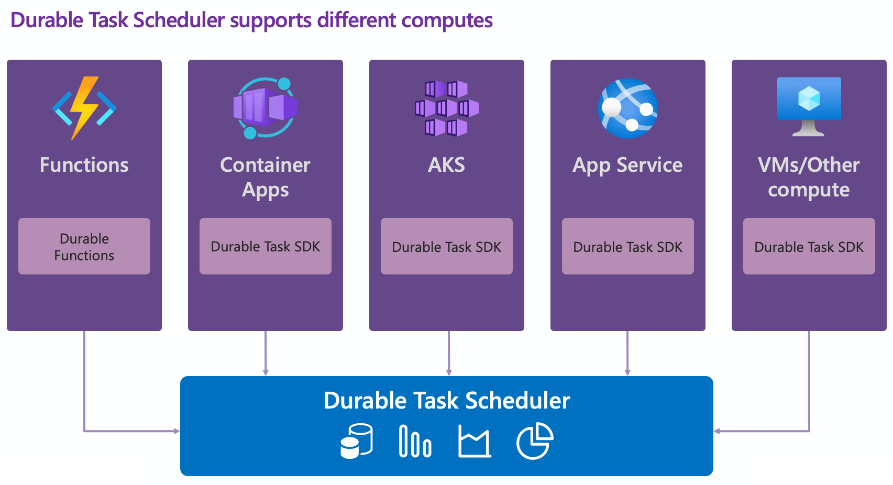

# Azure Durable Task

**Build reliable workflows that can recover after failures.**

[](./LICENSE.md)
[](https://aka.ms/dts-documentation)

---

## Table of Contents

- [What is Durable Task?](#what-is-durable-task)
- [Why Durable Task Scheduler?](#why-durable-task-scheduler)
- [Get Started in 5 Minutes](#-get-started-in-5-minutes)
- [Choose Your Framework](#choose-your-framework)
- [Samples](#samples)
- [Observability](#observability)
- [API Reference](#api-reference)
- [AI-Assisted Development](#ai-assisted-development)
- [Contributing](#contributing)
- [Community & Support](#community--support)

---
## What is Durable Task?

[Durable Task](http://aka.ms/durabletask) helps you build reliable workflows in code. A workflow is a series of steps that complete a task. You write these steps as normal functions. Durable Task saves their progress and coordinates work across services.

Workflows can run for hours, days, or even months. They can resume from saved progress after an app crashes, restarts, or is deployed again. Common uses include coordinating AI agents, processing data, managing infrastructure, and running processes across several services.

Durable Task includes three main parts:

- **Durable Task SDKs:** Build workflows in applications that you host.
- **[Durable Functions](https://learn.microsoft.com/azure/azure-functions/durable/durable-functions-overview):** Run workflows in serverless Azure Functions apps.
- **[Durable Task Scheduler](https://learn.microsoft.com/azure/azure-functions/durable/durable-task-scheduler/durable-task-scheduler):** Use a managed service to store workflow state and distribute work.

#### What is Durable Execution?

Durable execution means saving a workflow's progress automatically. The saved state allows the workflow to recover after an interruption.

---

## Why Durable Task Scheduler?

- 🏗️ **Managed service:** No workflow storage accounts to set up or service infrastructure to maintain.
- ⚡ **Direct work delivery:** gRPC streaming sends work to workers. Workers do not need to keep checking for new work.
- 📊 **Built-in dashboard:** View workflow status and history. Pause, stop, or restart workflows ([Learn more](https://learn.microsoft.com/azure/azure-functions/durable/durable-task-scheduler/durable-task-scheduler-dashboard)).
- 🛡️ **Separate service:** The scheduler runs as its own Azure resource, separate from your app.
- 📈 **Independent scaling:** Change the scheduler's capacity separately from your app. Several apps can share one scheduler.
- 🗂️ **Multiple task hubs:** Keep workloads separate by environment, team, or project ([Learn more](https://learn.microsoft.com/azure/azure-functions/durable/durable-task-scheduler/durable-task-scheduler#multiple-task-hubs)).
- 🐳 **Local development:** Run the emulator and its dashboard in Docker without an Azure connection.
- 🔐 **Azure authentication:** Use Microsoft Entra ID or managed identity. You do not need secrets in connection strings ([Learn more](https://learn.microsoft.com/azure/azure-functions/durable/durable-task-scheduler/durable-task-scheduler-identity)).
- 🌍 **Flexible hosting:** Run on Azure Functions, Container Apps, Azure Kubernetes Service (AKS), App Service, or virtual machines.



---

## ⚡ Get Started in 5 Minutes

### Step 0: Clone the repo

```bash
git clone --recurse-submodules https://github.com/Azure-Samples/Durable-Task-Scheduler.git
cd Durable-Task-Scheduler
```

> **Note:** The `--recurse-submodules` flag downloads sample code from linked repositories. If you already cloned the repo without this flag, run: `git submodule update --init --recursive`

### Step 1: Start the emulator

```bash
docker pull mcr.microsoft.com/dts/dts-emulator:latest
docker run -d -p 8080:8080 -p 8082:8082 mcr.microsoft.com/dts/dts-emulator:latest
```

### Step 2: Pick your language and run a sample

| Language | Quickstart Sample | Run Command |
|----------|-------------------|-------------|
| .NET | Function Chaining | `cd samples/durable-task-sdks/dotnet/FunctionChaining/Worker && dotnet run` |
| Python | Function Chaining | `cd samples/durable-task-sdks/python/function-chaining && pip install -r requirements.txt && python worker.py` |
| Java | Function Chaining | `cd samples/durable-task-sdks/java/function-chaining && ./gradlew runChainingPattern` |
| JavaScript | Function Chaining | `cd samples/durable-task-sdks/javascript/function-chaining && npm install && node worker.mjs` |
| Go (1.25+) | [Function Chaining](./samples/durable-task-sdks/go/function-chaining) | `cd samples/durable-task-sdks/go && go mod download && go run ./function-chaining` |

The Go samples use **`github.com/microsoft/durabletask-go` v1.0.0-beta.1**. Each sample starts its worker and client, runs a short demo, prints the result, and exits. Detailed checks are in separate tests.

The default connection is `Endpoint=http://localhost:8080;TaskHub=default;Authentication=None`. See the [Go quickstart](./docs/quickstart.md#go) for setup and Azure connection instructions.

### Step 3: Open the dashboard

Open **[http://localhost:8082](http://localhost:8082)** to view workflow status and history.

---

## Choose Your Framework

| | Durable Functions | Durable Task SDKs |
|---|---|---|
| **Best for** | Serverless apps that respond to events | Apps that run on containers, virtual machines, or other hosts |
| **Hosting** | Azure Functions | Container Apps, AKS, App Service, virtual machines, and other hosts |
| **Triggers** | HTTP requests, timers, queues, and more | You set up how workflows start |
| **Scaling** | Built-in automatic scaling | You manage scaling |
| **Languages** | .NET, Python, Java, JavaScript | .NET, Python, Java, JavaScript, Go (beta) |

Use the standalone Durable Task SDK for Go. Go is not supported by Durable Functions or the Durable extension for Microsoft Agent Framework.

📖 [Choosing an orchestration framework →](https://learn.microsoft.com/azure/azure-functions/durable/durable-task-scheduler/choose-orchestration-framework)

---

## Samples

Explore examples that you can run in several languages and frameworks, including the [Go SDK samples](./samples/durable-task-sdks/go).

📂 [**Full Sample Catalog →**](./samples/README.md)

### Featured Samples

🤖 **[AI Research Agent](./samples/durable-task-sdks/python/arXiv_research_agent):** An agent that searches arXiv, reviews papers, and writes research reports (Python).

✈️ **[AI Travel Planner](./samples/durable-functions/dotnet/AiAgentTravelPlanOrchestrator):** Plan trips with several AI agents and a human approval step (Durable Functions, .NET).

🛒 **[Order Processor](./samples/durable-functions/dotnet/OrderProcessor):** Process orders with inventory checks, payments, and notifications (Durable Functions, .NET).

🔄 **[Saga Pattern](./samples/durable-functions/dotnet/Saga):** Undo completed steps when a later step fails (Durable Functions, .NET).

🧩 **[Durable Extension for Microsoft Agent Framework](./samples/durable-extension-for-agent-framework/):** Add saved state and failure recovery to [Microsoft Agent Framework](https://github.com/microsoft/agent-framework) agents. Coordinate several agents in one workflow (.NET, Python).

---

## Observability

Use the **built-in dashboard** to check workflow status, review execution history, and manage running workflows.

The SDKs support **OpenTelemetry distributed tracing**. It helps you follow work as it moves between services. Durable Functions users can also use [distributed tracing V2](https://learn.microsoft.com/azure/azure-functions/durable/durable-functions-diagnostics#distributed-tracing) to investigate problems.

---

## API Reference

### Durable Task SDKs

- [.NET](https://learn.microsoft.com/dotnet/api/microsoft.durabletask?view=durabletask-dotnet-1.x)
- [Python](https://github.com/microsoft/durabletask-python)
- [Java](https://learn.microsoft.com/java/api/com.microsoft.durabletask?view=durabletask-java-1.x)
- JavaScript (coming soon)
- [Go (beta)](https://pkg.go.dev/github.com/microsoft/durabletask-go@v1.0.0-beta.1)

### Durable Functions

- [.NET (isolated)](https://learn.microsoft.com/dotnet/api/microsoft.azure.functions.worker.extensions.durabletask?view=azure-dotnet)
- [Python](https://learn.microsoft.com/python/api/azure-functions-durable/azure.durable_functions?view=azure-python)
- [Java](https://learn.microsoft.com/java/api/com.microsoft.durabletask.azurefunctions?view=azure-java-stable)
- [JavaScript](https://learn.microsoft.com/javascript/api/durable-functions/?view=azure-node-latest)

---

## AI-Assisted Development

This repository includes instruction files called skills for AI coding assistants, such as [GitHub Copilot](https://github.com/features/copilot) and [Claude Code](https://claude.ai/code). Skills provide setup instructions, code examples, and guidance for building durable workflows.

| Skill | Description | Path |
|-------|-------------|------|
| **durable-functions-dotnet** | Build orchestrations, activities, and entities with the .NET isolated worker | [Skill →](.github/skills/durable-functions-dotnet/SKILL.md) |
| **durable-task-dotnet** | Build .NET workflows without Azure Functions | [Skill →](.github/skills/durable-task-dotnet/SKILL.md) |
| **durable-task-java** | Build Java orchestrations and activities | [Skill →](.github/skills/durable-task-java/SKILL.md) |
| **durable-task-python** | Build Python workflows, entities, and agents that keep state | [Skill →](.github/skills/durable-task-python/SKILL.md) |
| **durable-task-go** | Set up the Go SDK (beta), build workflows, and test samples | [Skill →](.github/skills/durable-task-go/SKILL.md) |

**Usage:** Ask your AI assistant to read a skill before writing code. In Copilot Chat, you can reference a file, such as `#file:.github/skills/durable-task-dotnet/SKILL.md`. Claude Code can find relevant skills automatically.

---

## Contributing

We welcome contributions. Read [CONTRIBUTING.md](./CONTRIBUTING.md) to learn how to report issues, suggest changes, and open pull requests.

---

## Community & Support

- 📖 [Official Documentation](https://aka.ms/dts-documentation)
- 💬 [GitHub Issues](https://github.com/Azure/Durable-Task-Scheduler/issues): Report bugs and request features.
- 📧 Contact: [nicholas.greenfield@microsoft.com](mailto:nicholas.greenfield@microsoft.com), [jiayma@microsoft.com](mailto:jiayma@microsoft.com)

---

## License

This project uses the [MIT License](./LICENSE.md).

⭐ **Star this repo if you find it useful!**
