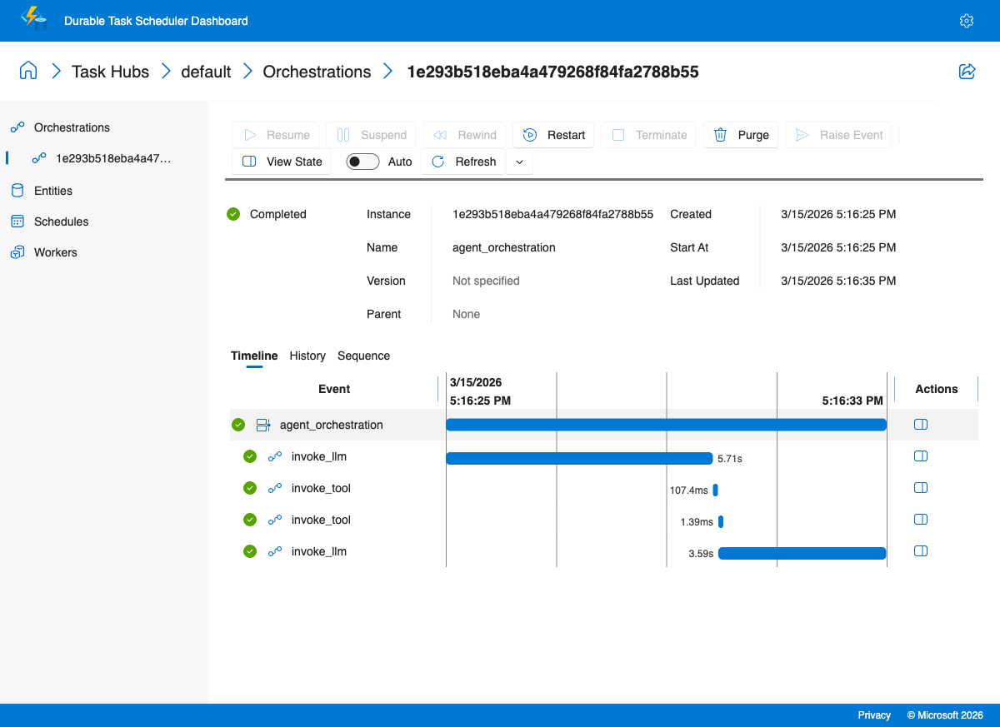
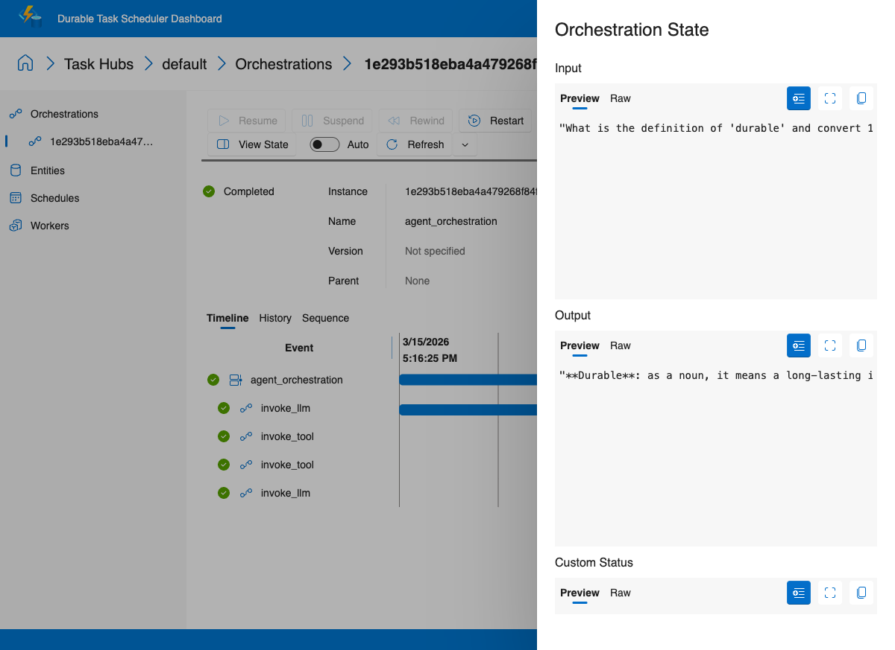

# Agentic Loop

> **New to Durable Task?** This recipe is the best starting point. Orchestrations contain your workflow logic and must be deterministic (replay-safe). Activities contain non-deterministic work like LLM calls and HTTP requests. Durable Task persists every completed step, so your workflow can resume exactly where it left off after any failure.

This recipe shows how to build a durable **tool-calling agent** with the Durable Task Python SDK, using language lookup, unit conversion, and curiosity-driven fact retrieval as practical tool examples.

This recipe includes two implementations:

- `openai-sdk/` keeps the tool-calling loop explicit in Durable Task orchestration and activities.
- `copilot-sdk/` keeps the same durable wrapper, but lets GitHub Copilot SDK handle the in-activity agent loop and tool execution.

## Why this pattern matters

A stateless agentic loop runs entirely in memory. If the process crashes mid-conversation — after the LLM has already called three tools — all conversation history is lost. The agent restarts from scratch, re-calls the same tools, and burns tokens reproducing work it already did.

A **durable** agentic loop checkpoints every tool call and every LLM response into orchestration history. When the worker restarts, Durable Task replays the completed steps without re-executing them and picks up the conversation exactly where it left off.

**This matters in production because:**

- **Token costs are real.** Re-running a 10-turn agent conversation because a worker restarted wastes money and time.
- **Tool calls have side effects.** If the agent already sent an email or updated a database, replaying from scratch may duplicate those actions. Durable checkpointing prevents this.
- **Long-running agents are fragile.** An agent that researches, plans, and executes over 30+ tool calls is almost guaranteed to hit a transient failure. Durability turns that from a total loss into a brief pause.

## What this recipe demonstrates

- An **agentic loop** that keeps calling the LLM until it produces a final answer
- **Dynamic tool dispatch** through a single tool-invoker activity
- **Durable conversation state** that survives restarts and retries
- A more distinctive tool set for educational and utility-focused interactions

## Tool set

- `lookup_word(word)` — fetches definitions from dictionaryapi.dev
- `convert_units(value, from_unit, to_unit)` — converts between common length, weight, volume, and temperature units
- `get_random_fact()` — fetches an interesting fact from the Useless Facts API

## Architecture

```text
+------+      +----------------------+      +----------------+
| User | ---> | Agent Orchestrator   | ---> | LLM Activity   |
+------+      | (durable while-loop) |      | Responses API  |
                 ^         |                    |
                 |         | tool calls         v
                 |         +--------------> +---------------+
                 |                           | Tool Activity |
                 +---------------------------+ invoke_tool   |
                                             +---------------+
```

## Key design decisions

1. **Tools stay loosely coupled through a registry**  
   The orchestrator always calls the same `invoke_tool` activity, while `tools/__init__.py` decides which concrete Python function to run.

2. **Conversation history is durable**  
   Every tool call and tool result is appended to history so the next LLM turn has the full context.

3. **Retry behavior lives in the orchestration**  
   The OpenAI client runs with `max_retries=0`, and Durable Task handles retries with explicit policies.

## Files

- `openai-sdk/worker.py` — runs the Durable Task worker against the local emulator
- `openai-sdk/client.py` — schedules the orchestration and prints the result
- `openai-sdk/orchestrations/agent.py` — durable agent loop
- `openai-sdk/activities/llm_activity.py` — OpenAI Responses API activity
- `openai-sdk/activities/tool_invoker.py` — dynamic tool dispatcher
- `openai-sdk/tools/` — dictionary, unit conversion, and random fact tools

## Running the recipe

1. Start the Durable Task Scheduler emulator:

   ```bash
   docker run --name dts-emulator -d -p 8080:8080 -p 8082:8082 \
     mcr.microsoft.com/dts/dts-emulator:latest
   ```

2. Install dependencies and configure Azure OpenAI credentials:

   ```bash
   cd openai-sdk
   python3 -m venv .venv
   source .venv/bin/activate
   pip install -r requirements.txt
   # Configure Azure OpenAI credentials (one-time setup)
   cp ../../.env.example ../../.env
   # Edit ../../.env with your Azure OpenAI API key and endpoint
   ```

3. Start the worker in one terminal:

   ```bash
   python worker.py
   ```

4. Run the client in a second terminal:

   ```bash
   python client.py "What does 'ephemeral' mean?"
   ```

5. Try other prompts such as:

   ```bash
   python client.py "Convert 72 degrees Fahrenheit to Celsius"
   python client.py "Tell me something interesting"
   ```

6. Open the emulator dashboard at <http://localhost:8082> to inspect the durable execution history.

## Sample interactions

### Dictionary lookup

```text
$ python client.py "What does 'ephemeral' mean?"
Ephemeral means lasting for a very short time...
```

### Unit conversion

```text
$ python client.py "Convert 72 degrees Fahrenheit to Celsius"
72 fahrenheit = 22.2222 celsius.
```

### Random fact

```text
$ python client.py "Tell me something interesting"
Here is a random fact: ...
```

### Direct answer without tool usage

```text
$ python client.py "Explain why durable execution helps long-running AI agents."
Durable execution lets the workflow resume from its last completed step after failures...
```

## Copilot SDK Variant

The new `copilot-sdk/` folder shows the same scenario with far less orchestration logic. Durable Task still wraps the work in a retryable activity, but GitHub Copilot SDK now handles the agentic loop, tool selection, and tool execution inside a single session.

What gets simpler:

- No manual durable `while` loop for function calls
- No separate tool-invoker activity or tool-call parsing code
- Tools are declared once with `@define_tool` and passed straight to the Copilot session

The sample client defaults to `What does 'ephemeral' mean, and convert 100 km to miles`.

### Sample output

```
$ python3 client.py "What is the definition of 'durable' and convert 100 kilometers to miles?"
Scheduled instance: 1e293b518eba4a479268f84fa2788b55
Status: COMPLETED
**Durable**: as a noun, it means a long-lasting item, especially one useful for more than one year.
**100 kilometers** = **62.14 miles**.
```

### Durable Task Scheduler Dashboard

The orchestration timeline shows the agentic loop — `invoke_llm` calls tools, which are invoked as separate activities, then `invoke_llm` resumes with tool results:



Click **View State** to inspect the orchestration input and output:


