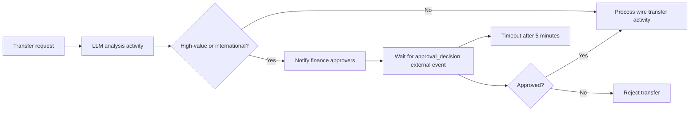
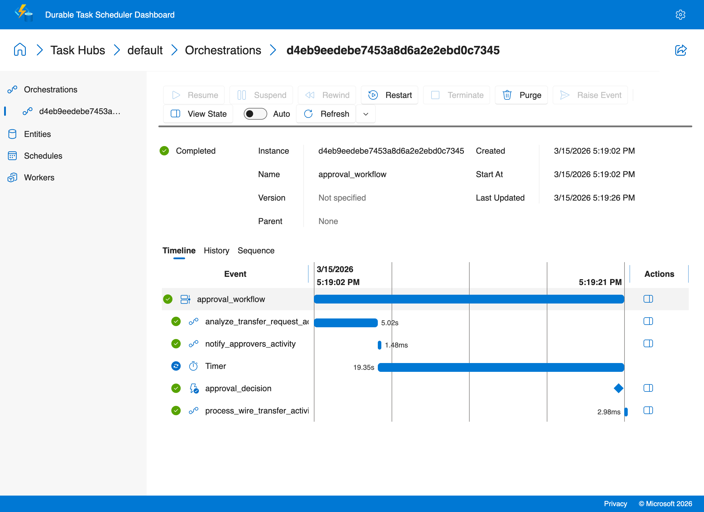
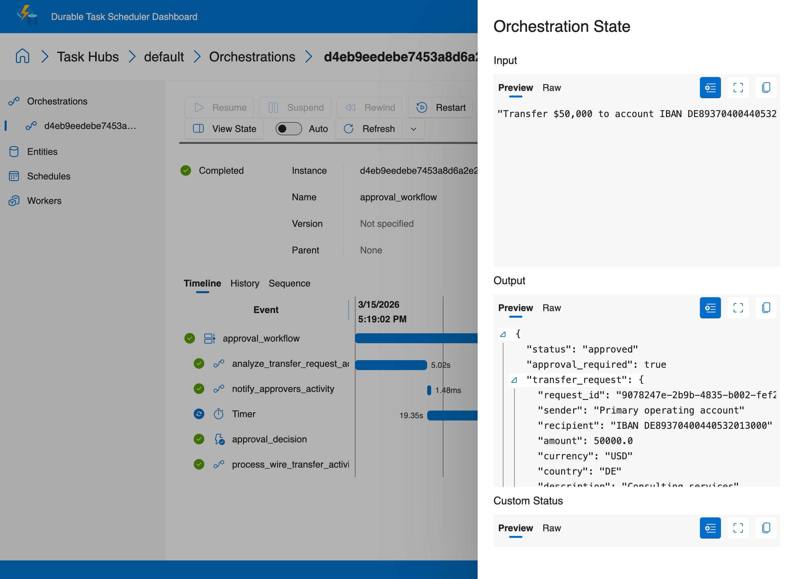

# Human-in-the-Loop

This recipe shows how to pause a durable AI workflow for **financial wire transfer approval**. The workflow analyzes a requested payment, automatically processes low-risk transfers, and durably waits for a human decision before sending high-value or international transfers.

## Overview

Human-in-the-loop (HITL) workflows are a practical safety pattern for financial automation. In this sample, an LLM activity extracts transfer details and evaluates risk indicators such as amount, destination country, recipient novelty, and unusual payment language. The orchestrator then enforces a simple approval policy:

1. Analyze the transfer request.
2. Automatically process low-risk domestic transfers.
3. Pause durably for human approval when the transfer is **over $10,000** or **international**.
4. Resume only after an approval or rejection event arrives.

Because the workflow is durable, it uses **zero compute while waiting**. State is stored in the Durable Task Scheduler, and the worker wakes up only when a decision event or timeout occurs.

## Architecture



## How external events work in Durable Task

Durable Task lets an orchestration pause by yielding `ctx.wait_for_external_event("event_name")`. That wait is persisted in orchestration history, so the worker can shut down safely while the workflow is pending.

In this recipe:

- The orchestration waits for `approval_decision`.
- `send_approval.py` raises the matching event with the reviewer decision.
- When the event arrives, the orchestration replays deterministically and continues from the waiting step.

The current Python Durable Task SDK does not expose a timeout parameter on `wait_for_external_event`, so the sample uses a **durable timer + race pattern**:

- `approval_event = ctx.wait_for_external_event("approval_decision")`
- `timeout_task = ctx.create_timer(ctx.current_utc_datetime + timedelta(minutes=5))`
- `winner = yield task.when_any([approval_event, timeout_task])`

## Directory layout

```text
ai-recipes/02-human-in-the-loop/
├── README.md
├── copilot-sdk/
│   ├── activities.py
│   ├── client.py
│   ├── orchestrations.py
│   ├── requirements.txt
│   ├── send_approval.py
│   └── worker.py
└── openai-sdk/
    ├── activities/
    │   ├── execute_action.py
    │   ├── llm_activity.py
    │   └── notify_approvers.py
    ├── orchestrations/
    │   └── approval_workflow.py
    ├── client.py
    ├── models.py
    ├── requirements.txt
    ├── send_approval.py
    └── worker.py
```

The `copilot-sdk/` variant keeps the same approval pattern, but uses GitHub Copilot SDK sessions for transfer analysis and post-approval execution.

## Running the recipe

### Prerequisites

- Python 3.11+
- Docker
- Optional: An Azure OpenAI endpoint and API key (configured via `ai-recipes/.env` — see `.env.example`) for LLM-based extraction and risk analysis

Start the DTS emulator if it is not already running:

```bash
docker run --name dtsemulator -d -p 8080:8080 -p 8082:8082 \
  mcr.microsoft.com/dts/dts-emulator:latest
```

Install dependencies:

```bash
cd ai-recipes/02-human-in-the-loop/openai-sdk
python3 -m venv .venv
source .venv/bin/activate
pip install -r requirements.txt
# Configure Azure OpenAI credentials (one-time setup)
cp ../../.env.example ../../.env
# Edit ../../.env with your Azure OpenAI API key and endpoint
```

### Terminal 1: Start the worker

```bash
cd ai-recipes/02-human-in-the-loop/openai-sdk
python3 worker.py
```

### Terminal 2: Submit a transfer request

High-risk example:

```bash
cd ai-recipes/02-human-in-the-loop/openai-sdk
python3 client.py "Transfer $50,000 to account IBAN DE89370400440532013000 in Germany for consulting services"
```

Low-risk example:

```bash
cd ai-recipes/02-human-in-the-loop/openai-sdk
python3 client.py "Transfer $500 to account 12345678 for office supplies"
```

The client prints the orchestration instance ID. For the high-risk example, the worker also prints a finance approval request with the analyzed transfer details.

### Terminal 3: Approve or reject the transfer

Approve it:

```bash
cd ai-recipes/02-human-in-the-loop/openai-sdk
python3 send_approval.py <instance_id> approve "Approved after finance review"
```

Or reject it:

```bash
cd ai-recipes/02-human-in-the-loop/openai-sdk
python3 send_approval.py <instance_id> reject "Recipient verification failed"
```

You can inspect orchestration history in the emulator dashboard at `http://localhost:8082`.

## Key design decisions

- **Transfer analysis runs in an activity** so OpenAI calls stay outside the deterministic orchestrator.
- **Approval waits use external events** so finance reviewers can respond from any process or integration point.
- **The orchestrator enforces a clear policy**: domestic transfers at or below $10,000 are auto-approved, while high-value or international transfers require a human decision.
- **Wire transfer processing is isolated in its own activity** so side effects only happen after policy checks and approvals.
- **Console notifications keep the demo simple** while making it easy to swap in email, Teams, Slack, or an operations dashboard later.

## Notes

- If Azure OpenAI credentials are not configured in `ai-recipes/.env`, `llm_activity.py` falls back to a heuristic parser and risk classifier so the sample still runs locally.

## Copilot SDK Variant

A second implementation lives in `copilot-sdk/`. It keeps the same durable approval flow, but uses the GitHub Copilot SDK for the transfer analysis step instead of making raw OpenAI API calls directly.

Why it is simpler:

- The activity uses `CopilotClient`, which manages the session lifecycle and avoids raw request/response plumbing.
- The orchestration still owns retries and approval policy, so the durable shape stays the same.
- This variant uses the shorter external event name `approval` instead of `approval_decision`.

Run it from `ai-recipes/02-human-in-the-loop/copilot-sdk/` with `python3 worker.py` and `python3 client.py`. If the run pauses for approval, send the decision with `python3 send_approval.py`.

### Sample output

```text
$ python3 client.py
Scheduled transfer approval workflow: d4eb9eedebe7453a8d6a2e2ebd0c7345
$ python3 send_approval.py d4eb9eedebe7453a8d6a2e2ebd0c7345 approve "Approved after finance review"
Sent approve decision for transfer workflow
Status: COMPLETED
{
  "status": "approved",
  "transfer_request": { "amount": 50000.0, "risk_level": "high", ... },
  "approval_decision": { "approved": true, "reason": "Approved after finance review" }
}
```

### Durable Task Scheduler Dashboard

The orchestration timeline shows the approval workflow — LLM analysis, external event wait, human approval, and transfer execution:



Click **View State** to inspect the orchestration input and output:


