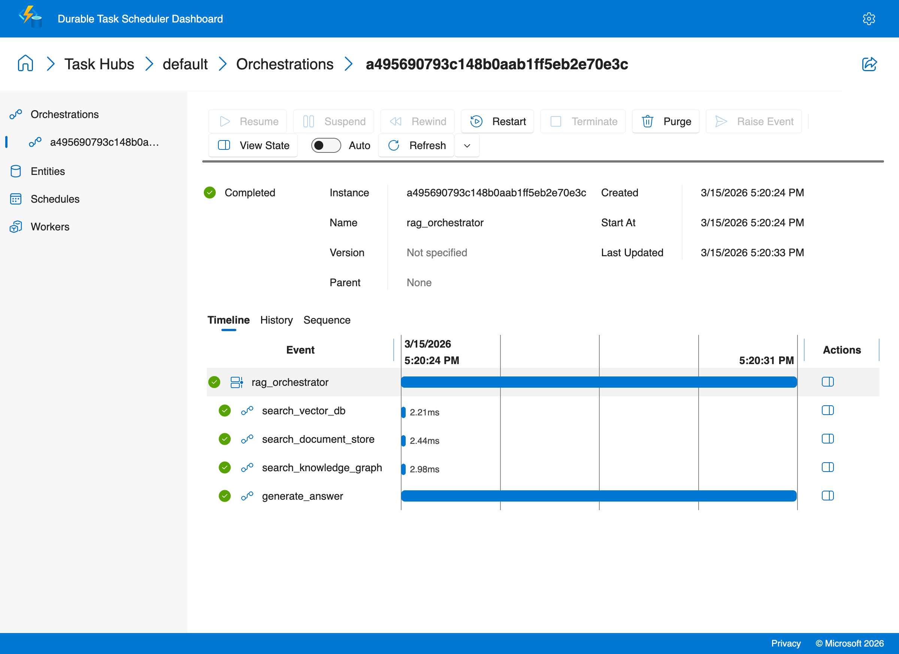
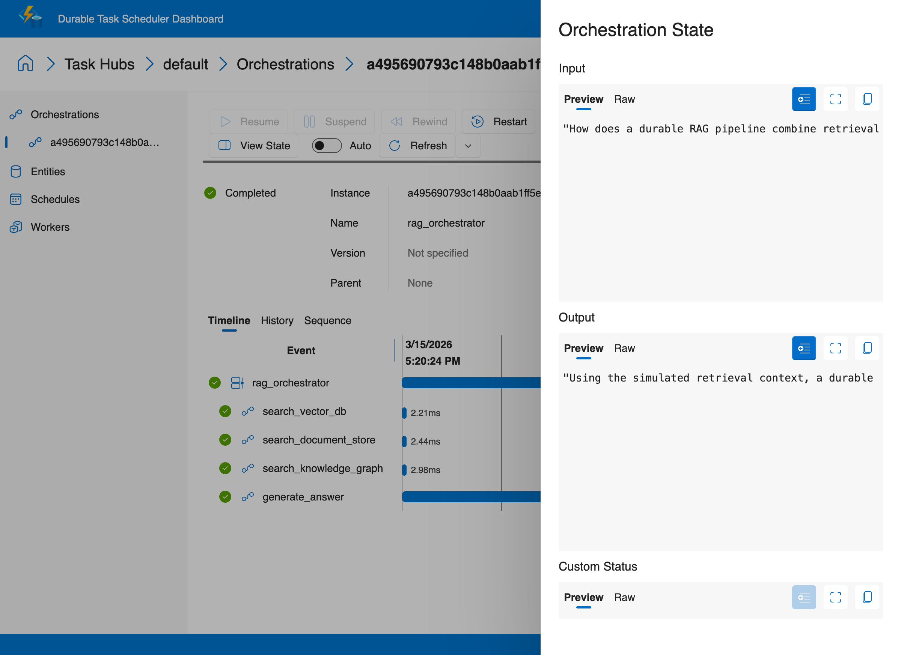

# RAG Pipeline

Build a durable retrieval-augmented generation (RAG) workflow with the Durable Task Python SDK. This recipe shows how to fan out to multiple retrievers in parallel, fan in their results, and then call an LLM to produce a grounded answer.

## Why this pattern matters

A basic RAG pipeline — call a vector DB, pass results to an LLM — works fine as a stateless function. So why make it durable?

**Because production RAG pipelines aren't basic.** When you query multiple retrieval sources in parallel (vector DB, document store, knowledge graph), real failure modes emerge:

- **Partial retriever failure.** Two of three retrievers return results, then the third times out. Without durability, you lose all three results and start over. With Durable Task, the two successful results are already checkpointed — only the failed retriever retries.
- **LLM synthesis failure.** The retrieval succeeds but the LLM call fails (rate limit, timeout, bad generation). Without durability, you re-run the entire retrieval phase. With Durable Task, retrieval results are persisted — you only retry the LLM call.
- **Cost compounds fast.** If your vector DB charges per query or your retrieval involves expensive embedding lookups, re-running successful retrievers on every failure adds up.

The **scheduled ingestion** pattern adds another dimension: a background loop that refreshes your indexed documents on a timer. Durable Task's `continue_as_new` keeps this loop running indefinitely without growing execution history, and the schedule itself survives worker restarts.

## What this recipe demonstrates

- **Fan-out/fan-in retrieval** across a simulated vector database, document store, and knowledge graph.
- **Grounded generation** by passing the combined retrieval context into a single LLM activity.
- **Scheduled ingestion** with an eternal orchestration that wakes up on a timer, ingests documents, and uses `continue_as_new` to repeat forever.

## Architecture

```text
User Query
    |
    v
+------------------+
| rag_orchestrator |
+------------------+
    |
    +--> search_vector_db --------+
    +--> search_document_store ---+--> Combine context --> generate_answer --> Answer
    +--> search_knowledge_graph --+
```

## Fan-out/fan-in pattern

The `rag_orchestrator` uses Durable Task's fan-out/fan-in pattern:

1. Schedule all three retrieval activities with `ctx.call_activity(...)`.
2. Wait for them together with `ctx.task_all(...)` (or `task.when_all(...)` as a compatibility fallback).
3. Combine the retrieval payloads into a single context block.
4. Call `generate_answer` to synthesize the final response.

Because the retrieval work is durable, each activity result is recorded in orchestration history. If the process crashes after two retrievers finish, Durable Task replays the completed work instead of repeating it.

## Scheduled ingestion with an eternal orchestration

The `ingestion_scheduler` orchestration models a background content-refresh loop:

1. Fetch the next list of documents to ingest.
2. Fan out ingestion work for each document in parallel.
3. Sleep for the configured interval using a durable timer.
4. Call `continue_as_new(...)` so the orchestration can run indefinitely without growing its execution history forever.

This pattern is useful for refreshing embeddings on a schedule, syncing external content sources, or rebuilding indexes overnight.

## Files

```text
ai-recipes/04-rag-pipeline/
├── copilot-sdk/
│   ├── activities.py
│   ├── client.py
│   ├── orchestrations.py
│   ├── requirements.txt
│   └── worker.py
├── openai-sdk/
│   ├── activities/
│   │   ├── ingest.py
│   │   ├── llm_generate.py
│   │   └── retriever.py
│   ├── orchestrations/
│   │   ├── ingestion_scheduler.py
│   │   └── rag_orchestrator.py
│   ├── client.py
│   ├── requirements.txt
│   └── worker.py
```

## Running the openai-sdk variant

```bash
cd ai-recipes/04-rag-pipeline/openai-sdk
pip install -r requirements.txt

# Configure Azure OpenAI credentials (one-time setup)
cp ../../.env.example ../../.env
# Edit ../../.env with your Azure OpenAI API key and endpoint

# Terminal 1
python worker.py

# Terminal 2
python client.py query "How do durable RAG pipelines work?"
```

To start the scheduled ingestion loop instead:

```bash
python client.py schedule-ingestion --interval-minutes 60 \
  https://contoso.example/docs/durable-task-overview \
  https://contoso.example/docs/rag-refresh-playbook
```

## Copilot SDK Variant

A second implementation lives in `copilot-sdk/`. It keeps the same retrieval fan-out/fan-in pattern—parallel searches over the vector database, document store, and knowledge graph—but swaps the final generation step to a GitHub Copilot SDK session.

Why it is simpler:

- Only the answer-generation activity changes; the retrieval orchestration pattern stays the same.
- The activity uses `CopilotClient` directly, so it replaces the raw OpenAI request and response-handling code.
- `worker.py` registers the same retrieval activities plus `generate_answer_copilot`, and `client.py` runs the orchestration with a default RAG query.

Run it from `ai-recipes/04-rag-pipeline/copilot-sdk/` with `python3 worker.py` and `python3 client.py`.

## Notes

- The retrieval and ingestion steps are intentionally simulated so the recipe can focus on orchestration structure.
- The Azure OpenAI activity disables SDK retries (`max_retries=0`) so Durable Task owns retry behavior.
- You can swap the mock retrievers for real vector, document, or graph backends without changing the orchestration pattern.

### Sample output

```text
$ python3 client.py query
Started RAG orchestration: a495690793c148b0aab1ff5eb2e70e3c
Answer: Using the simulated retrieval context, a durable RAG pipeline combines retrieval
and generation by retrieving relevant knowledge from indexed sources...
```

### Durable Task Scheduler Dashboard

The orchestration timeline shows the fan-out/fan-in RAG pipeline — three parallel retrieval activities followed by LLM synthesis:



Click **View State** to inspect the orchestration input and output:


