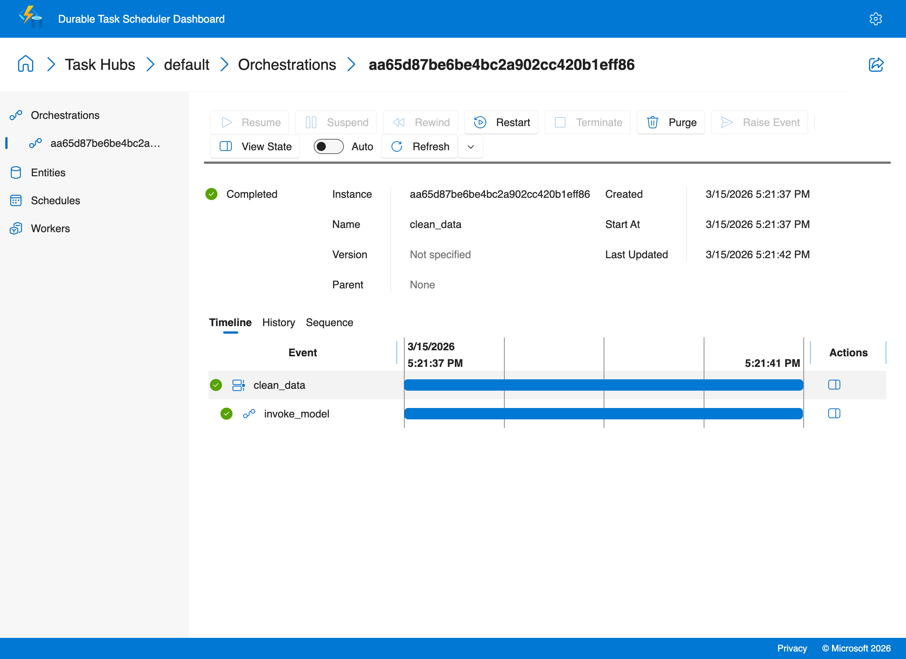
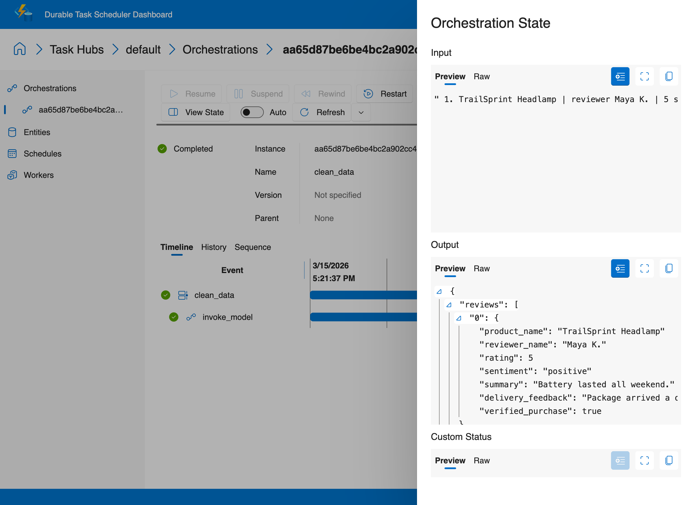

# Structured Outputs

Use Durable Task plus Azure OpenAI structured outputs to turn messy, non-deterministic LLM extraction into a predictable workflow. This recipe focuses on normalizing semi-structured product reviews into a validated `ProductReviewList` model.

## Why this pattern matters

You might think: "I can just use `response_format` with the OpenAI API — why do I need an orchestration?"

For a single extraction call, you don't. But in production, LLM output validation is inherently unreliable:

- **Models don't always follow schemas.** Even with structured output mode, LLMs occasionally produce values outside expected ranges, miss required fields, or generate invalid enum values. A single call can't handle this — you need a retry loop that re-prompts the model with the validation error.
- **Durable retries are smarter than client retries.** When Durable Task retries a failed validation, the retry is recorded in orchestration history with the exact error. You get full observability into why extraction failed and how many attempts it took — critical for tuning prompts and schemas.
- **Batch processing multiplies the problem.** Processing 1,000 product reviews through an LLM means 1,000 chances for a validation failure. Durable Task retries each failed extraction independently without losing the 999 that already succeeded.
- **The orchestration stays trivially simple.** Accept input → call model activity → return validated output. All the complexity (LLM call, parsing, validation, error handling) is isolated in the activity where non-deterministic behavior is allowed.

## What this recipe demonstrates

- **Structured outputs with Pydantic** using `client.responses.parse(...)`.
- **Validation inside an activity**, where non-deterministic model output is allowed.
- **Durable retries** in the orchestration, so validation failures automatically trigger a bounded retry policy.

## Why validation belongs in the activity

Orchestrators must stay deterministic, so the LLM call and schema validation both happen inside `invoke_model`. If the model returns data that fails Pydantic validation, the activity raises an exception. Durable Task records that failure and retries the activity according to the orchestration's retry policy.

That design keeps the orchestration simple:

1. Accept the messy input string.
2. Call the model activity with `ProductReviewList` as the target schema.
3. Retry up to three times if the model cannot satisfy the schema.
4. Return the cleaned payload once validation succeeds.

## Code walkthrough

### 1. Pydantic schema

`models/reviews.py` defines:

- `ProductReview` for one normalized record.
- `ProductReviewList` for the full output collection.
- A rating validator that rejects values outside the 1-to-5 range.

### 2. Model invocation activity

`activities/invoke_model.py`:

- Disables Azure OpenAI client retries so Durable Task controls recovery.
- Calls `responses.parse(...)` with `ProductReviewList` as the structured output format.
- Extracts the parsed Pydantic object from the SDK response.
- Returns a JSON-friendly dictionary with `model_dump(mode="json")`.

### 3. Durable orchestration

`orchestrations/clean_data.py` applies a `RetryPolicy` with three attempts. This is important for non-deterministic model behavior: a transient formatting error or partial extraction can be retried without rerunning the whole application manually.

## Files

```text
ai-recipes/05-structured-outputs/
├── openai-sdk/
│   ├── activities/
│   │   └── invoke_model.py
│   ├── models/
│   │   └── reviews.py
│   ├── orchestrations/
│   │   └── clean_data.py
│   ├── client.py
│   ├── requirements.txt
│   └── worker.py
```

## Copilot SDK Variant

A parallel `copilot-sdk/` implementation now lives beside `openai-sdk/`. Instead of relying on Azure OpenAI structured outputs directly, the Copilot agent extracts review data, calls a custom `submit_reviews` tool for validation, and only then returns JSON to the workflow.

Why this version is simpler:

- The parsing instructions and validation contract live in one Copilot session
- The `submit_reviews` tool provides fast feedback when the generated structure is invalid
- Durable retries still wrap the activity, so malformed final output can be retried safely

The client sends messy review notes by default so you can compare the validated Copilot flow with the existing structured-output sample.

## Running the openai-sdk variant

```bash
cd ai-recipes/05-structured-outputs/openai-sdk
pip install -r requirements.txt

# Configure Azure OpenAI credentials (one-time setup)
cp ../../.env.example ../../.env
# Edit ../../.env with your Azure OpenAI API key and endpoint

# Terminal 1
python worker.py

# Terminal 2
python client.py
```

The sample client sends intentionally messy product review notes so you can watch the workflow produce normalized, schema-validated output.

### Sample output

```text
$ python3 client.py
Started structured-output orchestration: aa65d87be6be4bc2a902cc420b1eff86
Cleaned reviews:
{
  "reviews": [
    { "product_name": "TrailSprint Headlamp", "rating": 5, "sentiment": "positive" },
    { "product_name": "HomeBlend Mixer", "rating": 4, "sentiment": "mixed" },
    { "product_name": "Northwind Coffee Pods", "rating": 3, "sentiment": "mixed" }
  ]
}
```

### Durable Task Scheduler Dashboard

The orchestration timeline shows the structured output orchestration — a single `invoke_model` activity call with Pydantic-validated response parsing:



Click **View State** to inspect the orchestration input and output:


