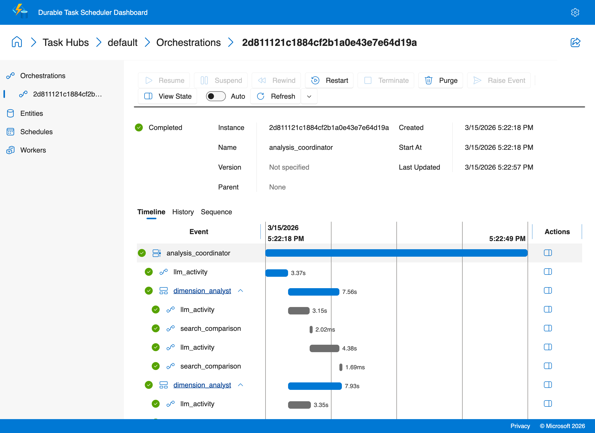
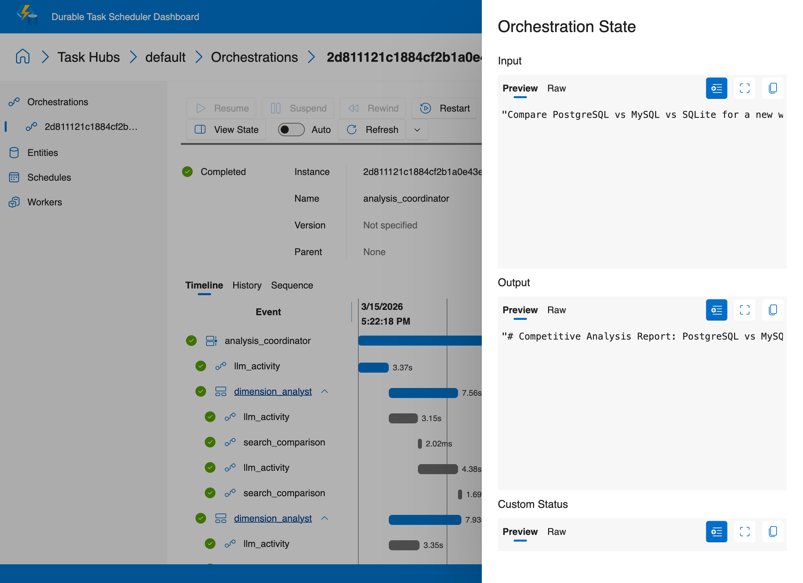

# Competitive Analysis Agent

This recipe turns a comparison prompt into a decision-oriented workflow instead of generic open-ended research. The durable coordinator identifies comparison dimensions, fans out focused analysts in parallel, then produces a structured comparison matrix and recommendation.

## Why this pattern matters

You could ask a single LLM prompt: "Compare PostgreSQL vs MySQL vs SQLite." You'd get a generic answer that mixes everything together, hallucinates details, and lacks structured decision criteria.

**Structured multi-step research produces dramatically better results:**

- **Focused analysis beats broad prompts.** Each dimension analyst (performance, ecosystem, operational complexity) researches only its assigned area. Focused prompts produce more accurate, less hallucination-prone results than one giant prompt trying to cover everything.
- **Independent retriability.** If the "ecosystem" analyst fails (LLM timeout, rate limit), you don't lose the "performance" and "operational complexity" analyses that already completed. Durable Task replays the successful sub-orchestrations and retries only the failed one.
- **Parallelism saves time.** Five dimension analysts running in parallel take the same wall-clock time as one. For research tasks that involve multiple LLM calls per dimension, this is a significant speedup.
- **Structured output, not narrative.** The synthesis step produces a comparison matrix and pros/cons table — actionable artifacts, not a wall of text.

This is the difference between asking a colleague "tell me about databases" and assigning five specialists to research one aspect each, then having an analyst synthesize their findings into a decision framework.

This recipe includes two implementations:

- `openai-sdk/` keeps the decomposition, analyst workflow, and final synthesis explicit in Durable Task activities and sub-orchestrations.
- `copilot-sdk/` keeps the same durable fan-out/fan-in coordinator shape, but uses GitHub Copilot SDK custom agents to decompose the question, research each dimension, and synthesize the final report.

## How this differs from generic research

- The workflow starts with explicit comparison dimensions instead of broad sub-questions.
- Each analyst owns one dimension only, such as performance, ecosystem, or operational complexity.
- The output is a competitive analysis report with a comparison matrix and pros/cons table, not just a narrative summary.

## Architecture

```text
+---------------------------+
| analysis_coordinator      |
| - identify products       |
| - identify dimensions     |
| - fan out analysts        |
+-------------+-------------+
              |
   +----------+----------+----------+
   |          |          |          |
+--v---+  +---v--+  +----v-+  +-----v----+
|perf  |  |ecosys|  |ops   |  |fit/learn |
|analyst| |analyst| |analyst| |analyst   |
+--+---+  +---+--+  +----+-+  +-----+----+
   |          |          |           |
   +----------+----------+-----------+
              |
              v
   +---------------------------+
   | create_comparison_report  |
   +---------------------------+
```

## What the workflow does

1. Accept a comparison query such as `Compare React vs Vue vs Svelte for enterprise apps`.
2. Use an LLM activity to identify the products being compared and the most useful decision dimensions.
3. Launch one `dimension_analyst` sub-orchestration per dimension.
4. Let each analyst gather dimension-specific findings for its assigned area.
5. Fan the dimension results back into `create_comparison_report` to generate a structured matrix, pros/cons table, and recommendation.

## Running the openai-sdk variant

```bash
cd ai-recipes/06-deep-research/openai-sdk
python3 -m pip install -r requirements.txt
# Configure Azure OpenAI credentials (one-time setup)
cp ../../.env.example ../../.env
# Edit ../../.env with your Azure OpenAI API key and endpoint

# Terminal 1
python3 worker.py

# Terminal 2
python3 client.py
python3 client.py "Compare React vs Vue vs Svelte for enterprise apps"
```

The client defaults to:

```text
Compare PostgreSQL vs MySQL vs SQLite for a new web application
```

Start the Durable Task Scheduler emulator first if you are running locally:

```bash
docker run --name dtsemulator -d -p 8080:8080 -p 8082:8082 \
  mcr.microsoft.com/dts/dts-emulator:latest
```

View execution history at `http://localhost:8082`.

## Files

```text
ai-recipes/06-deep-research/
├── copilot-sdk/
│   ├── activities.py
│   ├── agents.py
│   ├── client.py
│   ├── orchestrations.py
│   ├── requirements.txt
│   └── worker.py
└── openai-sdk/
    ├── activities/
    │   ├── llm_activity.py
    │   ├── search.py
    │   └── synthesize.py
    ├── orchestrations/
    │   ├── analysis_coordinator.py
    │   └── dimension_analyst.py
    ├── client.py
    ├── requirements.txt
    └── worker.py
```

## Copilot SDK variant

The `copilot-sdk/` implementation keeps the same durable coordinator -> parallel dimension analysts -> final report pattern, but moves the reasoning into Copilot SDK custom agents inside durable activities.

What changes:

- `decompose_query` uses a Copilot agent to choose the most useful decision dimensions.
- Each `research_dimension` activity runs a focused Copilot research agent for one comparison angle.
- `synthesize_report` uses a Copilot summarizer to assemble the final recommendation from the collected findings.

Run it from `ai-recipes/06-deep-research/copilot-sdk/` with `python3 worker.py` and `python3 client.py`.

### Sample output

```text
$ python3 client.py
Started competitive analysis orchestration: 2d811121c1884cf2b1a0e43e7e64d19a
# Competitive Analysis Report: PostgreSQL vs MySQL vs SQLite
## 1) Executive Summary
For a new web application, the best default choice is PostgreSQL...
```

### Durable Task Scheduler Dashboard

This dashboard shows the deep research pattern — coordinator orchestration fanning out to parallel dimension analyst sub-orchestrations, then synthesizing a final report:



Click **View State** to inspect the orchestration input and output:


