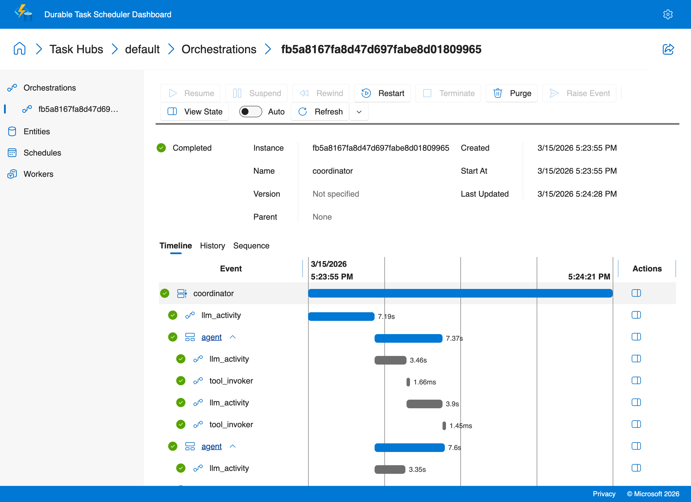
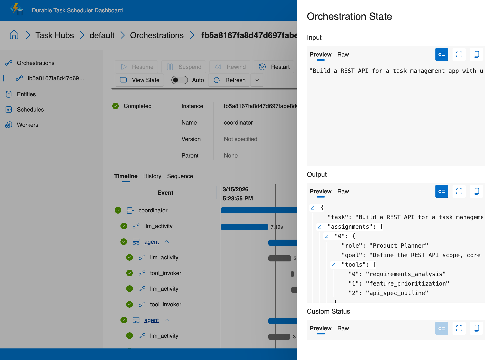

# Multi-Agent Orchestration

This recipe demonstrates a coordinator plus agent swarm pattern where multiple durable
sub-orchestrations collaborate through a durable entity that holds shared state.

## Why this pattern matters

When a task is too complex for one agent — like planning, building, and reviewing an API design — you need multiple specialized agents working together. The question is: how do they coordinate?

**Common alternatives and their problems:**

- **Shared database.** Agents write findings to a database, coordinator polls for completion. You now manage a database, handle connection failures, deal with race conditions, and add infrastructure that has nothing to do with your AI workflow.
- **Message queues.** Agents post to queues. You need queue infrastructure, dead-letter handling, and ordering guarantees. More moving parts, more failure modes.
- **Sequential single-agent.** One agent does everything in order. Slow, no parallelism, and if it fails at step 5 of 7, you start over.

**Durable entities solve this natively:**

- **Shared state without infrastructure.** The entity holds findings, status, and coordination data. No database, no queue — it lives in the same Durable Task backend your orchestrations already use.
- **Ordered operations.** Entity operations are serialized automatically. No locks, no race conditions, no "two agents wrote at the same time" bugs.
- **Replay-safe communication.** Agents signal the entity with `signal_entity()`. On replay, these signals are deterministically replayed without re-executing.
- **Parallel agents, durable state.** All agents run as parallel sub-orchestrations. If one fails, the others' contributions are already recorded in the entity. The failed agent retries independently.

This recipe includes two implementations:

- `openai-sdk/` shows the coordinator, durable entity, and sub-orchestration swarm with explicit LLM activities.
- `copilot-sdk/` keeps the same durable coordinator/entity structure, but uses Copilot planner, executor, and reviewer agents inside the activities.

## Architecture

```text
+-------------------+
| coordinator       |
| - assign roles    |
| - launch agents   |
| - synthesize      |
+---------+---------+
          |
  +-------+--------+--------+
  |                |        |
+-v------+     +---v----+ +-v------+
|Agent A |     |Agent B | |Agent C |
|Planner |     |Research| |Critic  |
+---+----+     +---+----+ +---+----+
    \             |          /
     \            |         /
      +-----------v--------+
      | sharedstate entity |
      | findings + status  |
      +--------------------+
```

## Why durable entities are useful here

Durable entities provide:

- Shared context without introducing an external coordination database.
- Durable, replay-safe state updates as agents progress.
- Ordered operations for predictable inter-agent communication.
- Native orchestration integration through `signal_entity` and `call_entity`.

## What this workflow does

1. Take a complex task description.
2. Use a planning activity to decompose the task into agent assignments.
3. Spawn multiple agent sub-orchestrations in parallel.
4. Let each agent complete its assigned work and signal the shared entity with findings.
5. Read the shared entity state and synthesize a final result.

## Running the openai-sdk variant

```bash
cd ai-recipes/07-multi-agent/openai-sdk
pip install -r requirements.txt
# Configure Azure OpenAI credentials (one-time setup)
cp ../../.env.example ../../.env
# Edit ../../.env with your Azure OpenAI API key and endpoint

# Terminal 1
python worker.py

# Terminal 2
python client.py "Plan a durable AI rollout for a regulated enterprise team"
```

Start the Durable Task Scheduler emulator first if you are running locally:

```bash
docker run --name dtsemulator -d -p 8080:8080 -p 8082:8082 \
  mcr.microsoft.com/dts/dts-emulator:latest
```

View execution history at `http://localhost:8082`.

## Copilot SDK variant

The `copilot-sdk/` implementation keeps the durable coordinator + shared entity pattern, but swaps the manual agent logic for three focused Copilot SDK roles:

- `planner` breaks the task into a small set of parallel sub-tasks.
- `executor` handles one sub-task per durable sub-orchestration.
- `reviewer` evaluates the combined results and produces the final recommendation.

Run it from `ai-recipes/07-multi-agent/copilot-sdk/` with `python worker.py` and `python client.py`.

### Sample output

```text
$ python3 client.py "Build a REST API for a task management app with user authentication"
Started multi-agent orchestration: fb5a8167fa8d47d697fabe8d01809965
{
  "task": "Build a REST API for a task management app with user authentication",
  "assignments": [
    { "role": "Product Planner", "goal": "Define the REST API scope..." },
    { "role": "API Architect", "goal": "Design the RESTful endpoints..." },
    { "role": "Backend Engineer", "goal": "Implement the server-side application..." }
  ]
}
```

### Durable Task Scheduler Dashboard

This dashboard shows the multi-agent coordination pattern — coordinator dispatching parallel agent sub-orchestrations via a shared durable entity:



Click **View State** to inspect the orchestration input and output:


