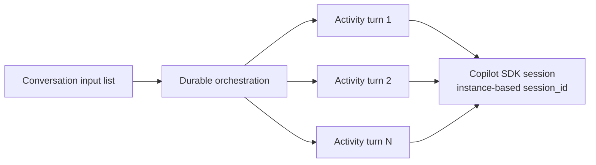
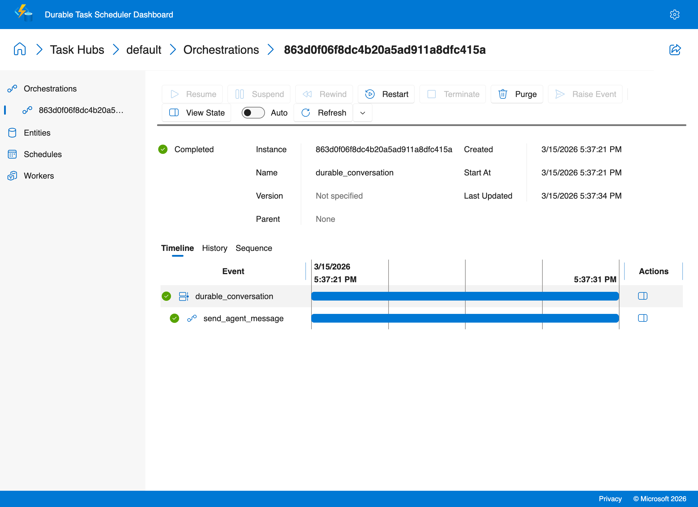
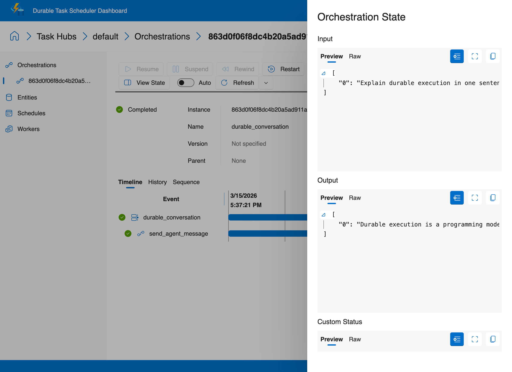

# Durable Agent Session

This recipe is available as a **copilot-sdk-only** implementation. It shows how Durable Task can manage the lifecycle of a **Copilot SDK agent session** across a multi-turn conversation.

Each user message is processed by a separate durable activity call. The orchestration uses a deterministic session ID derived from the orchestration instance ID, so the Copilot session can be resumed after worker crashes, restarts, or redeployments.

## Why this pattern matters

Long-running agent conversations are often fragile when the session only lives in memory. By letting Durable Task coordinate each turn, you get:

- durable checkpoints after every completed message
- replay-safe orchestration state
- retries around transient failures
- session resumption after process restarts

## Architecture



## Included variant

- [copilot-sdk](./copilot-sdk/) - The only variant for this recipe, demonstrating durable management of a resumable Copilot SDK conversation session

This recipe intentionally stays `copilot-sdk/`-only because the main pattern being demonstrated is durable lifecycle management for a GitHub Copilot session itself. See [`copilot-sdk/README.md`](./copilot-sdk/README.md) for the runnable variant-specific guide.

### Sample output

```
$ python3 client.py "Explain durable execution in one sentence"
Started durable conversation: 863d0f06f8dc4b20a5ad911a8dfc415a

Turn 1 user: Explain durable execution in one sentence
Turn 1 assistant: Durable execution is a programming model where long-running workflows
automatically persist their state so they can pause, resume, and recover reliably across
restarts, failures, and time.
```

### Durable Task Scheduler Dashboard

The dashboard timeline shows the durable conversation orchestration — each turn is a separate `send_agent_message` activity backed by a Copilot SDK session:



Click **View State** to inspect the orchestration input and output:


