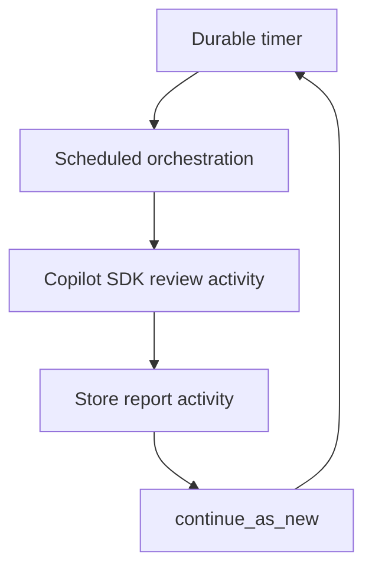
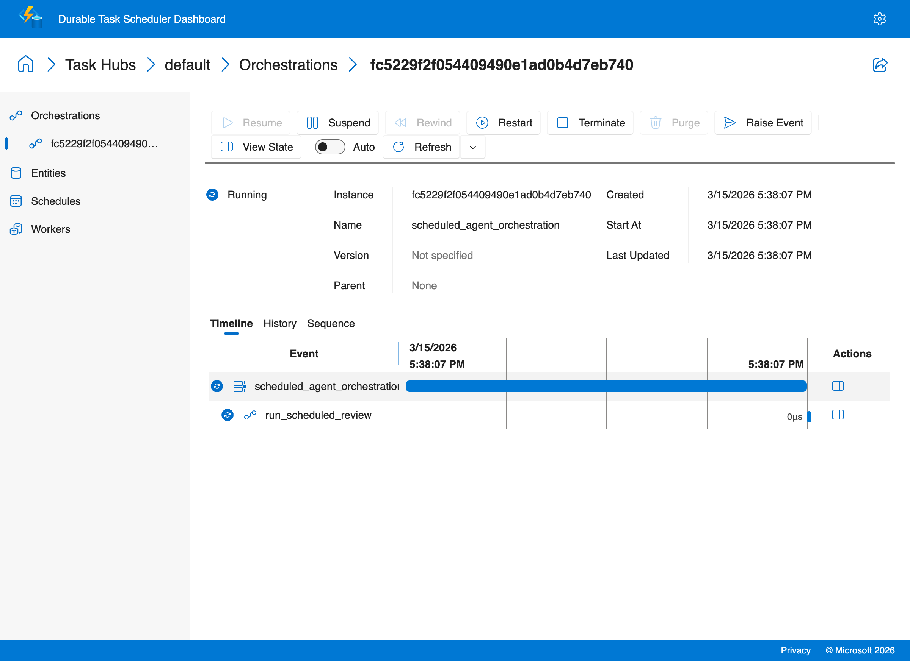
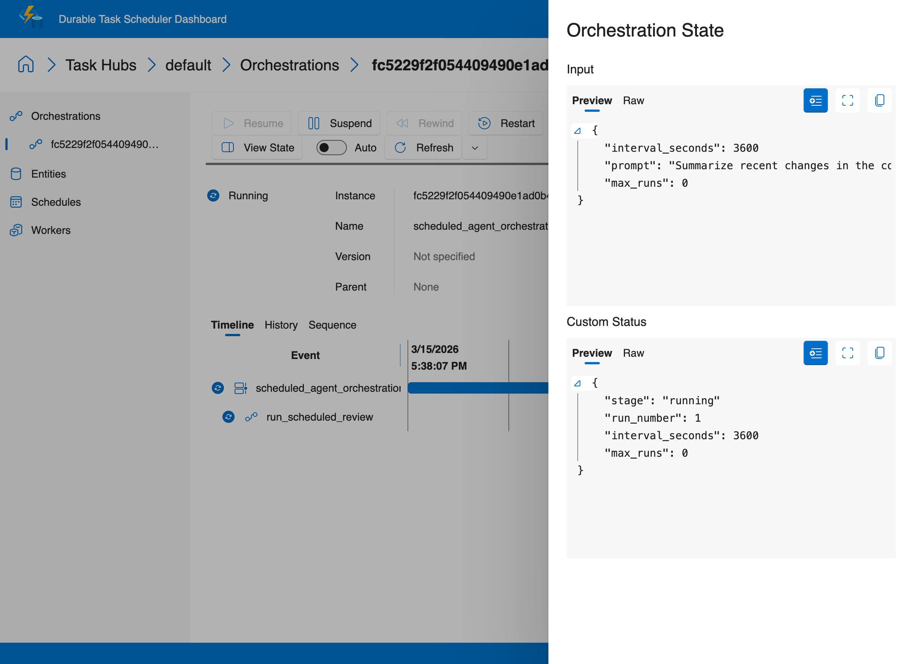

# Scheduled Agent

This recipe is available as a **copilot-sdk-only** implementation. It shows how to run a **Copilot SDK agent on a durable schedule** using an eternal orchestration.

Durable Task handles the timer, persistence, retries, and lifecycle management. The Copilot SDK provides the reasoning engine for each scheduled run.

## Why this pattern matters

Many AI workloads are periodic rather than request-driven, such as:

- daily code review summaries
- hourly monitoring digests
- recurring TODO or dependency scans
- scheduled research or compliance reports

With Durable Task, the schedule itself is durable. If the worker goes down while the orchestration is sleeping, the timer and next run are preserved.

## Architecture



## Included variant

- [copilot-sdk](./copilot-sdk/) - The only variant for this recipe, demonstrating durable scheduled Copilot SDK runs with continue-as-new

This recipe intentionally stays `copilot-sdk/`-only because the core idea is a durable schedule that repeatedly invokes a GitHub Copilot agent. See [`copilot-sdk/README.md`](./copilot-sdk/README.md) for the runnable variant-specific guide.

### Sample output

```
$ python3 client.py
Started scheduled agent orchestration: fc5229f2f054409490e1ad0b4d7eb740
Runtime status: RUNNING
This orchestration is designed to keep running until terminated.
```

### Durable Task Scheduler Dashboard

The dashboard timeline shows the scheduled agent orchestration — a durable timer followed by agent execution, repeating via `continue_as_new`:



Click **View State** to inspect the orchestration input and output:


