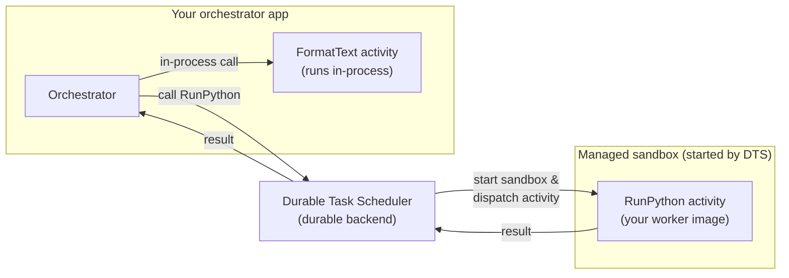

# On-demand Sandboxes for Azure Durable Task Scheduler

> **Status:** Private preview

## Get private preview access

To gain access to the private preview, email [dts-team@microsoft.com](mailto:dts-team@microsoft.com).

## Overview

A *sandbox* is an isolated, microVM-backed container that runs a single piece of your
workflow with its own runtime, dependencies, and security boundary—separate from your
orchestrator's process.

On-demand Sandboxes let you move individual workflow steps (activities) out of your
orchestrator process and into managed, isolated compute, while your orchestrator stays
exactly where it is. You tell Durable Task Scheduler (DTS) which activities should run
in isolation and provide a container image with that activity code; DTS handles
provisioning, scaling, and teardown.

Most activities belong in-process: they're fast, simple, and co-located with your
orchestrator. But some steps don't fit that model—they need a native binary, a
different language runtime, per-invocation isolation, or bursty compute you don't want
to keep warm. On-demand Sandboxes handle those exceptions without dedicated
infrastructure or custom scaling policies.

## Why it's valuable

- **Activity-level granularity.** Move individual steps to managed compute, not your
  whole app.
- **Per-activity or per-invocation isolation.** Each execution runs in a clean,
  microVM-backed sandbox—ideal for untrusted code, customer plugins, or LLM-generated
  logic.
- **Cross-runtime flexibility.** Run a Python inference step from a .NET orchestrator,
  with no compromise on either side.
- **Scale-to-zero.** Pay for CPU and memory per second of execution, not for
  infrastructure that sits idle.
- **No orchestrator changes.** Your orchestration code and hosting model don't change
  at all.

## Prerequisites

Before you begin, make sure you have:

- **Private preview access.** On-demand Sandboxes is in private preview.
  [Sign up here](https://techcommunity.microsoft.com/blog/AppsonAzureBlog/introducing-on-demand-sandboxes-for-azure-durable-task-scheduler-private-preview/4522333)
  to have the feature enabled on your scheduler.
- **An app using a supported standalone Durable Task SDK.** On-demand Sandboxes target
  the standalone Durable Task SDKs used *outside* the Azure Functions host—apps running
  on Azure Container Apps, Azure Kubernetes Service, App Service, or anywhere else you
  self-host. The private preview supports the **.NET** and **Python** SDKs; additional
  language SDKs and Azure Functions support are coming soon.
- **A provisioned Durable Task Scheduler** configured as the durable backend for your app.
- **A container registry** (for example, Azure Container Registry) where you can push
  the worker image that contains your sandboxed activity code.
- **User-assigned managed identities** (Python preview flow) that DTS uses to pull your
  worker image and start the sandbox. You provide their client IDs on the worker profile
  (`image_pull_managed_identity_client_id` and `scheduler_managed_identity_client_id`).

## How it works

On-demand Sandboxes use a two-part model:

1. A **sandbox worker profile** in your orchestrator app that tells DTS which activities
   to offload.
2. A **worker image** that contains those activity implementations.

Your orchestrator still calls activities the same way it always has. The decision to run
an activity in a sandbox lives entirely in the profile configuration.

### A simple example

Imagine an orchestrator that does two things: format some text in-process, then run a
piece of customer-supplied Python in isolation. Only the second activity is declared in a
sandbox worker profile, so DTS runs it in a managed sandbox started from your worker
image—while the first activity stays in-process. The result flows back to the
orchestrator as if nothing special happened.

1. The orchestrator runs `FormatText` in-process, like any normal activity.
2. When it calls `RunPython`—an activity declared in a sandbox worker profile—DTS starts a
   sandbox from your worker image and dispatches the activity to it.
3. The activity runs in the isolated sandbox, and its result flows back through DTS to the
   orchestrator. When the work is done, DTS tears the sandbox down.

## Choose your language

Follow the step-by-step guide for your SDK:

- **[.NET guide](./docs/dotnet.md)** — declare a sandbox worker profile and build the worker
  image with the .NET Durable Task SDK.
- **[Python guide](./docs/python.md)** — declare a sandbox worker profile and build the worker
  image with the Python Durable Task SDK.

Both guides follow the same shape: declare a sandbox worker profile in your orchestrator
app, build and push a worker image, then view execution logs in the DTS dashboard.

## Worker profile configuration reference

Both languages configure the same worker profile settings. The table below lists each
setting, what it controls, its accepted values, and its default. The setting names differ
slightly between .NET (`PascalCase`) and Python (`snake_case`) but map one to one.

| Setting (.NET / Python) | What it controls | Accepted values | Default |
| --- | --- | --- | --- |
| `ContainerImage` / `container_image` | The container image that holds your activity implementations. | A full OCI image reference, by tag (`myregistry.azurecr.io/workers/hello:1.0`) or digest (`myregistry.azurecr.io/workers/hello@sha256:...`). | *Required* |
| `Cpu` / `cpu` | CPU quantity declared for each sandbox. | A positive CPU quantity, expressed in millicores (`500m`, `1000m`) or whole/fractional cores (`2`, `0.5`). | `1000m` (1 vCPU) |
| `Memory` / `memory` | Memory quantity declared for each sandbox. | A positive memory quantity, such as `256Mi`, `1Gi`, or a bare number interpreted as MiB (`2048`). | `2048Mi` |
| `MaxConcurrentActivities` / `max_concurrent_activities` | How many activities a single sandbox worker instance processes concurrently. | An integer greater than `0`. There is no enforced upper bound; size it to what your activity and resource shape can handle. | `100` |
| `EnvironmentVariables` / `environment_variables` | Customer environment variables injected into the sandbox at runtime. | A map of string keys to string values. | Empty |
| *(profile id)* | Friendly profile id that groups the image, resources, and activities for monitoring and reuse. | A non-empty string, unique across your declared profiles. | `default` |
| `AddActivity` / `add_activity` | The activity names this profile offloads to the sandbox. | One or more activity names. At least one is required; an activity can belong to only one profile. | *Required* |

> [!NOTE]
> CPU and memory must be positive resource quantities. The platform may apply additional
> per-preview ceilings on the total CPU and memory a sandbox can request—check your
> private preview onboarding details for the current limits.

## View logs in the DTS dashboard

Once your sandbox activities are running, you can view their execution logs directly in
the Durable Task Scheduler dashboard. The dashboard shows real-time output from your
managed workers, including stdout, stderr, and activity lifecycle events—giving you full
visibility into what's happening inside the sandbox without configuring external log
sinks or building your own observability pipeline.

## Get started

On-demand Sandboxes is in private preview. To get access,
[sign up here](https://techcommunity.microsoft.com/blog/AppsonAzureBlog/introducing-on-demand-sandboxes-for-azure-durable-task-scheduler-private-preview/4522333).
Once you're in, the workflow is straightforward: declare a sandbox worker profile in
your orchestrator app, build and push a worker image, and DTS takes care of the rest.

## Related resources

- **Documentation:** [Durable Task Scheduler overview](https://learn.microsoft.com/azure/durable-task/)
- **Samples:** [.NET sample](./samples/dotnet) · [Python sample](./samples/python)
- **Pricing:** [Azure Durable Task Scheduler pricing](https://azure.microsoft.com/pricing/)
- **Feedback:** Open an issue in the
  [Durable-Task-Scheduler GitHub repo](https://github.com/Azure-Samples/Durable-Task-Scheduler).
