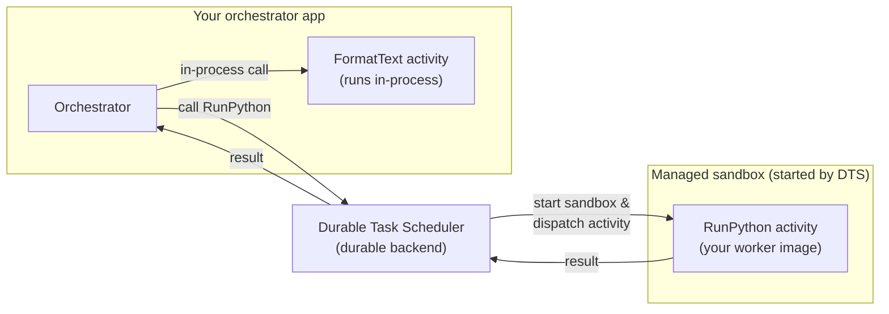

# On-demand Sandboxes for Azure Durable Task Scheduler

> **Status:** Private preview

## Get private preview access

To gain access to the private preview, email [dts-team@microsoft.com](mailto:dts-team@microsoft.com).

You'll need a Durable Task Scheduler in one of the supported preview regions. You can use
an existing scheduler or create a new one in any of these regions:

- East US 2 (`eastus2`)
- West US 3 (`westus3`)
- North Europe (`northeurope`)
- Australia East (`australiaeast`)

Reply to us with your scheduler name and the region it's in, and we'll enable On-demand
Sandboxes on it.

## Overview

A *sandbox* is an isolated, microVM-backed container that runs a single piece of your
workflow with its own runtime, dependencies, and security boundary, separate from your
orchestrator's process.

On-demand Sandboxes let you move individual workflow steps (activities) out of your
orchestrator process and into managed, isolated compute, while your orchestrator stays
exactly where it is. You tell Durable Task Scheduler (DTS) which activities should run
in isolation and provide a container image with that activity code; DTS handles
provisioning, scaling, and teardown.

Most activities belong in-process: they're fast, simple, and co-located with your
orchestrator. But some steps don't fit that model. They need a native binary, a
different language runtime, per-invocation isolation, or bursty compute you don't want
to keep warm. On-demand Sandboxes handle those exceptions without dedicated
infrastructure or custom scaling policies.

## Why it's valuable

- **Activity-level granularity.** Move individual steps to managed compute, not your
  whole app.
- **Per-activity or per-invocation isolation.** Each execution runs in a clean,
  microVM-backed sandbox, ideal for untrusted code, customer plugins, or LLM-generated
  logic.
- **Cross-runtime flexibility.** Run a Python inference step from a .NET orchestrator,
  with no compromise on either side.
- **Scale-to-zero.** Pay for CPU and memory per second of execution, not for
  infrastructure that sits idle.
- **No orchestrator changes.** Your orchestration code and hosting model don't change
  at all.

## How it works

On-demand Sandboxes use a two-part model:

1. A **sandbox worker profile** in your orchestrator app that tells DTS which activities
   to offload.
2. A **worker image** that contains those activity implementations.

Your orchestrator still calls activities the same way it always has. The decision to run
an activity in a sandbox lives entirely in the profile configuration.

### A simple example

Imagine an orchestrator that does two things: format some text in-process, then run a
piece of customer-supplied Python in isolation. Only the second activity is declared in a
sandbox worker profile, so DTS runs it in a managed sandbox started from your worker
image, while the first activity stays in-process. The result flows back to the
orchestrator as if nothing special happened.

1. The orchestrator runs `FormatText` in-process, like any normal activity.
2. When it calls `RunPython` (an activity declared in a sandbox worker profile), DTS starts a
   sandbox from your worker image and dispatches the activity to it.
3. The activity runs in the isolated sandbox, and its result flows back through DTS to the
   orchestrator. When the work is done, DTS tears the sandbox down.

## Get started

On-demand Sandboxes is in private preview. To get access, email
[dts-team@microsoft.com](mailto:dts-team@microsoft.com). You'll need a scheduler in one of
the [supported preview regions](#get-private-preview-access).

Once you're in, follow the step-by-step guide for your SDK:

- **[.NET guide](./docs/dotnet.md):** declare a sandbox worker profile and build the worker
  image with the .NET Durable Task SDK.
- **[Python guide](./docs/python.md):** declare a sandbox worker profile and build the worker
  image with the Python Durable Task SDK.

Both guides follow the same shape: declare a sandbox worker profile in your orchestrator
app, build and push a worker image, then view execution logs in the DTS dashboard. Each
guide also includes a worker profile configuration reference for its SDK.

## Related resources

- **Documentation:** [Durable Task Scheduler overview](https://learn.microsoft.com/azure/durable-task/)
- **Samples:** [.NET sample](./samples/dotnet) · [Python sample](./samples/python)
- **Pricing:** [Azure Durable Task Scheduler pricing](https://azure.microsoft.com/pricing/)
- **Feedback:** Open an issue in the
  [Durable-Task-Scheduler GitHub repo](https://github.com/Azure-Samples/Durable-Task-Scheduler).
