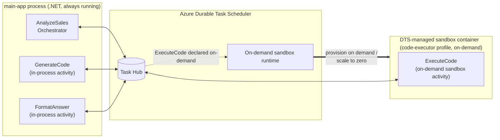

# On-demand Sandboxes demo: LLM-generated code interpreter

A three-step Durable Task workflow that demonstrates the **On-demand Sandboxes** preview
of Azure Durable Task Scheduler (DTS).

```
   ┌─────────────────────────┐    ┌─────────────────────────┐    ┌─────────────────────────┐
   │  GenerateCode           │    │  ExecuteCode            │    │  FormatAnswer           │
   │  (in-process .NET)      │ -> │  (on-demand sandbox)    │ -> │  (in-process .NET)      │
   │  Azure OpenAI -> Python │    │  python3 + pandas       │    │  Pretty-print answer    │
   └─────────────────────────┘    └─────────────────────────┘    └─────────────────────────┘
```

The orchestrator asks a natural-language question over `data/sales_q1.csv`. The LLM
returns a self-contained pandas script. That script is **untrusted** code, so it runs in
a DTS-managed on-demand sandbox - not in the orchestrator's process. The first and last
activities stay in-process; only `ExecuteCode` is offloaded.

## Why this is a fit for On-demand Sandboxes

- The generated Python is arbitrary code. It should not run in the orchestrator host.
- The sandbox needs a different runtime (Python + pandas) than the orchestrator (.NET).
- Each invocation gets a fresh container. No cross-request state to worry about.
- Bursty by nature - a question every few minutes, but each one is short-lived.

## Architecture



**How it works:**

- The orchestrator and its in-process activities (`GenerateCode`, `FormatAnswer`) run in the always-on `main-app` process and exchange work items with the DTS task hub.
- `ExecuteCode` is declared as an on-demand sandbox activity by the `code-executor` worker profile (see `main-app/WorkerProfiles.cs`). The activity is never registered in the main app.
- When the orchestrator calls `ExecuteCode`, the DTS on-demand sandbox runtime provisions a sandbox container from the profile's image. The sandbox picks up the work item, runs it, returns the result, and is scaled back to zero when idle.
- The orchestrator's call site (`CallActivityAsync(TaskNames.ExecuteCode, ...)`) is identical to any other activity call — the "this runs in a sandbox" decision lives entirely in the worker profile declaration.

## Layout

```
dts-ondemand-sandbox-codegen-demo/
├── Directory.Build.props          # Points at the durabletask-dotnet SDK source
├── data/sales_q1.csv              # Sample dataset (~35 rows)
├── main-app/                      # Orchestrator host (.NET 10)
│   ├── Program.cs
│   ├── AnalyzeSalesOrchestrator.cs
│   ├── Activities.cs              # GenerateCode + FormatAnswer (in-process)
│   ├── Contracts.cs
│   └── TaskNames.cs
└── sandbox-worker/                # Built into the sandbox container image
    ├── Program.cs                 # UseSandboxWorker()
    ├── ExecuteCodeActivity.cs     # Shells out to python3
    ├── Contracts.cs
    └── Containerfile
```

## Prerequisites

- .NET 10 SDK
- Docker (for building the sandbox image)
- A DTS scheduler + task hub you can hit
- An Azure Container Registry with anonymous pull enabled (so DTS can fetch the sandbox image)
- An Azure OpenAI deployment of a chat model (GPT-4o, GPT-4.1, etc.)
- The `durabletask-dotnet` repo checked out alongside (or override `DtsSdkRoot`)

Default layout assumed:

```
~/durabletask-dotnet/                 # private preview SDK source
~/workspace/dts-ondemand-sandbox-codegen-demo/   # this repo
```

If your durabletask-dotnet checkout lives elsewhere, override `DtsSdkRoot` on every
`dotnet` and `docker build` command (examples below).

## Build the sandbox image

From the demo root:

```bash
ACR=<your-acr-name>
IMAGE=$ACR.azurecr.io/dts-codegen-sandbox:v1

docker build \
  --platform linux/amd64 \
  -f sandbox-worker/Containerfile \
  --build-context sdk=$HOME/durabletask-dotnet \
  -t $IMAGE \
  .

# Enable anonymous pull so DTS can fetch the sandbox image without credentials
az acr update --name $ACR --anonymous-pull-enabled true

az acr login --name $ACR
docker push $IMAGE
```

> **Note on `--platform linux/amd64`:** Required on Apple Silicon. The `Grpc.Tools`
> 2.78.0 linux_arm64 `protoc` binary segfaults under Docker's arm64 emulation.
> amd64 builds work fine under Rosetta and match what DTS sandboxes run anyway.

## Run the orchestrator

```bash
export DTS_ENDPOINT="https://<scheduler-endpoint>"
export DTS_TASK_HUB="<task-hub>"
export DTS_SANDBOX_CONTAINER_IMAGE="<acr>.azurecr.io/dts-codegen-sandbox:v1"
export DTS_SANDBOX_IMAGE_PULL_UMI_CLIENT_ID="<image-pull UMI client ID>"
export DTS_SANDBOX_SCHEDULER_UMI_CLIENT_ID="<scheduler UMI client ID>"

export AOAI_ENDPOINT="https://<your-aoai>.openai.azure.com"
export AOAI_DEPLOYMENT="<your-chat-deployment>"

# Sign in so DefaultAzureCredential can reach DTS and Azure OpenAI
az login

dotnet run --project main-app/main-app.csproj -- \
  "Which region had the highest total revenue in March 2025?"
```

The orchestrator prints the question, the orchestration id, and the final answer.
The main-app console shows the AOAI-generated Python (prefixed `[generate]`) before
it's handed off to the sandbox. The sandbox container logs (prefixed `[sandbox]`)
stream through the DTS dashboard's **On-demand Sandboxes** tab while `ExecuteCode`
runs — that's where you see the code, dataset load, execution timing, and script output.

## Sample questions to try

- `Which region had the highest total revenue in March 2025?`
- `What was the best-selling product in Q1?`
- `Average revenue per transaction in February?`
- `Total units sold in the East region across the quarter?`

## What's in-process vs on-demand sandbox

| Activity        | Runs where         | Why                                                    |
| --------------- | ------------------ | ------------------------------------------------------ |
| GenerateCode    | In-process         | Plain Azure OpenAI HTTP call. No reason to split out.  |
| ExecuteCode     | **Sandbox**        | Untrusted LLM-generated code + different runtime.      |
| FormatAnswer    | In-process         | Trivial string formatting.                             |

Only `ExecuteCode` is declared on the `code-executor` sandbox worker profile via
`options.AddActivity(...)` (see `main-app/WorkerProfiles.cs`). Everything
else runs wherever the orchestrator runs.
