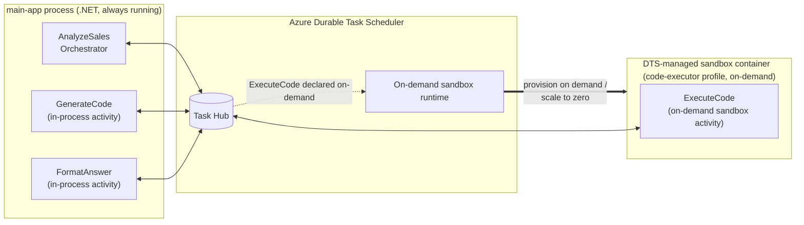

# On-demand Sandboxes demo: LLM-generated code interpreter

A three-step Durable Task workflow that demonstrates the **On-demand Sandboxes** preview
of Azure Durable Task Scheduler (DTS).

The orchestrator asks a natural-language question over `data/sales_q1.csv`. The LLM
returns a self-contained pandas script. That script is **untrusted** code, so it runs in
a DTS-managed on-demand sandbox - not in the orchestrator's process. The first and last
activities stay in-process; only `ExecuteCode` is offloaded.

## Why this is a fit for On-demand Sandboxes

- The generated Python is arbitrary code. It should not run in the orchestrator host.
- The sandbox needs a different runtime (Python + pandas) than the orchestrator (.NET).
- Each invocation gets a fresh container. No cross-request state to worry about.
- Bursty by nature - a question every few minutes, but each one is short-lived.

## Architecture



**How it works:**

- The orchestrator and its in-process activities (`GenerateCode`, `FormatAnswer`) run in the always-on `main-app` process and exchange work items with the DTS task hub.
- `ExecuteCode` is declared as an on-demand sandbox activity by the `code-executor` worker profile (see `main-app/WorkerProfiles.cs`). The activity is never registered in the main app.
- When the orchestrator calls `ExecuteCode`, the DTS on-demand sandbox runtime provisions a sandbox container from the profile's image. The sandbox picks up the work item, runs it, returns the result, and is scaled back to zero when idle.
- The orchestrator's call site (`CallActivityAsync(TaskNames.ExecuteCode, ...)`) is identical to any other activity call. The "this runs in a sandbox" decision lives entirely in the worker profile declaration.

## Layout

```
dts-ondemand-sandbox-codegen-demo/
├── Directory.Build.props          # Pins the DTS preview package version
├── data/sales_q1.csv              # Sample dataset (~35 rows)
├── azure.yaml                     # azd service + hooks (Deploy to Azure)
├── infra/                         # Bicep: AKS, ACR, identity, Azure OpenAI, scheduler wiring
├── scripts/                       # acr-build.sh + attach-scheduler-identity.sh (azd hooks)
├── main-app/                      # Orchestrator host (.NET 10), deployed to AKS
│   ├── Program.cs
│   ├── AnalyzeSalesOrchestrator.cs
│   ├── Activities.cs              # GenerateCode + FormatAnswer (in-process)
│   ├── Contracts.cs
│   ├── TaskNames.cs
│   ├── Containerfile              # main-app image
│   └── manifests/                 # K8s deployment template
└── sandbox-worker/                # Built into the sandbox container image
    ├── Program.cs                 # UseSandboxWorker()
    ├── ExecuteCodeActivity.cs     # Shells out to python3
    ├── Contracts.cs
    └── Containerfile
```

## Prerequisites

- .NET 10 SDK
- Docker (for building the sandbox image)
- A DTS scheduler + task hub you can hit
- An Azure Container Registry with anonymous pull enabled (so DTS can fetch the sandbox image)
- An Azure OpenAI deployment of a chat model (GPT-4o, GPT-4.1, etc.)
- The Durable Task on-demand sandbox preview packages (`1.25.0-preview.2`) available on
  a NuGet feed you can restore from

## Build the sandbox image

From the demo root:

```bash
ACR=<your-acr-name>
IMAGE=$ACR.azurecr.io/dts-codegen-sandbox:v1

docker build \
  --platform linux/amd64 \
  -f sandbox-worker/Containerfile \
  -t $IMAGE \
  .

# Enable anonymous pull so DTS can fetch the sandbox image without credentials
az acr update --name $ACR --anonymous-pull-enabled true

az acr login --name $ACR
docker push $IMAGE
```

> **Note on `--platform linux/amd64`:** Required on Apple Silicon. The `Grpc.Tools`
> 2.78.0 linux_arm64 `protoc` binary segfaults under Docker's arm64 emulation.
> amd64 builds work fine under Rosetta and match what DTS sandboxes run anyway.

## Run the orchestrator

```bash
export DTS_ENDPOINT="https://<scheduler-endpoint>"
export DTS_TASK_HUB="<task-hub>"
export DTS_SANDBOX_CONTAINER_IMAGE="<acr>.azurecr.io/dts-codegen-sandbox:v1"
export DTS_SANDBOX_IMAGE_PULL_UMI_CLIENT_ID="<image-pull UMI client ID>"
export DTS_SANDBOX_SCHEDULER_UMI_CLIENT_ID="<scheduler UMI client ID>"

export AOAI_ENDPOINT="https://<your-aoai>.openai.azure.com"
export AOAI_DEPLOYMENT="<your-chat-deployment>"

# Sign in so DefaultAzureCredential can reach DTS and Azure OpenAI
az login

dotnet run --project main-app/main-app.csproj -- \
  "Which region had the highest total revenue in March 2025?"
```

The orchestrator prints the question, the orchestration id, and the final answer.
The main-app console shows the AOAI-generated Python (prefixed `[generate]`) before
it's handed off to the sandbox. The sandbox container logs (prefixed `[sandbox]`)
stream through the DTS dashboard's **On-demand Sandboxes** tab while `ExecuteCode`
runs. That's where you see the code, dataset load, execution timing, and script output.

## Deploy to Azure (AKS) with `azd`

The `infra/` folder and `azure.yaml` deploy the **main-app** orchestrator to **Azure
Kubernetes Service** with [`azd`](https://learn.microsoft.com/azure/developer/azure-developer-cli/install-azd).
The sandbox worker image is built and pushed to ACR; DTS starts it on demand, so it is
never deployed to the cluster.

> The Durable Task Scheduler is **not created** by this template. You pass in an
> existing one. On-demand Sandboxes is a private-preview feature that must be enabled on
> the scheduler out of band, so the scheduler is patched separately and supplied here by
> name. The scheduler must be in a supported preview region: East US 2, West US 3, North
> Europe, or Australia East.

### What gets provisioned

| Resource | Purpose |
|----------|---------|
| **AKS cluster** | Hosts the `main-app` orchestrator pod (workload identity enabled) |
| **Azure Container Registry** | Stores the main-app and sandbox-worker images (built server-side via ACR Tasks) |
| **User-assigned managed identity** + federated credential | Pod auth to DTS/Azure OpenAI, ACR pull for the sandbox, and the sandbox's connection back to DTS |
| **Azure OpenAI** + `gpt-5.1` deployment | Backs the in-process `GenerateCode` activity |

The deployment also **ensures the task hub** exists, grants the identity the roles it
needs (AcrPull, Durable Task data access, Cognitive Services OpenAI User), and a
`postprovision` hook **attaches the identity to your scheduler** (a merge-safe PATCH).

### Prerequisites

- An existing **DTS scheduler** with the On-demand Sandboxes preview enabled, and its
  resource group name.
- [Azure Developer CLI (`azd`)](https://learn.microsoft.com/azure/developer/azure-developer-cli/install-azd), [Azure CLI](https://learn.microsoft.com/cli/azure/install-azure-cli), and [kubectl](https://kubernetes.io/docs/tasks/tools/).
- Azure OpenAI quota for `gpt-5.1` (`GlobalStandard`) in your target region (default
  `eastus`; override with `AZURE_OPENAI_LOCATION`).

### Deploy

```bash
azd auth login && az login

# Point the template at your existing (preview-enabled) scheduler.
azd env set DTS_SCHEDULER_NAME "<scheduler-name>"
azd env set DTS_SCHEDULER_RESOURCE_GROUP "<scheduler-resource-group>"
# Optional overrides: DTS_TASK_HUB (default: default), AZURE_OPENAI_LOCATION

azd up
```

`azd` provisions the resources, builds both images via ACR Tasks, attaches the identity
to your scheduler, and deploys the `main-app` pod. If you don't set `DTS_SCHEDULER_NAME`
/ `DTS_SCHEDULER_RESOURCE_GROUP` first, `azd` prompts for them.

### Verify

```bash
az aks get-credentials --resource-group <rg-name> --name <aks-name>   # from `azd env get-values`
kubectl get pods
kubectl logs -l app=mainapp --tail=50
```

The `main-app` pod runs the orchestration; `[sandbox]` logs from `ExecuteCode` stream in
the DTS dashboard's **On-demand Sandboxes** tab.

### Clean up

```bash
azd down
```

This removes the resources the template created. Your scheduler is left untouched (it was
not created here); detach the identity manually if you no longer need it.

## Sample questions to try

- `Which region had the highest total revenue in March 2025?`
- `What was the best-selling product in Q1?`
- `Average revenue per transaction in February?`
- `Total units sold in the East region across the quarter?`

## What's in-process vs on-demand sandbox

| Activity        | Runs where         | Why                                                    |
| --------------- | ------------------ | ------------------------------------------------------ |
| GenerateCode    | In-process         | Plain Azure OpenAI HTTP call. No reason to split out.  |
| ExecuteCode     | **Sandbox**        | Untrusted LLM-generated code + different runtime.      |
| FormatAnswer    | In-process         | Trivial string formatting.                             |

Only `ExecuteCode` is declared on the `code-executor` sandbox worker profile via
`options.AddActivity(...)` (see `main-app/WorkerProfiles.cs`). Everything
else runs wherever the orchestrator runs.
