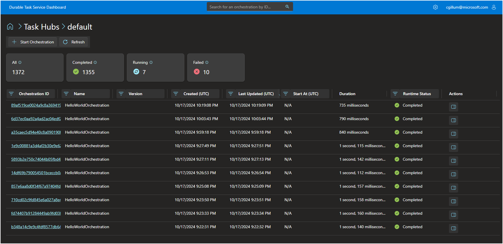

# Hello World with the Durable Task Framework (DTFx)

In addition to [Durable Functions](https://learn.microsoft.com/azure/azure-functions/durable/durable-functions-overview), the [Durable Task Framework (DTFx)](https://github.com/Azure/durabletask) for .NET can also use the Durable Task Scheduler service for managing orchestration state.

> **NOTE:**
> DTFx is not an officially supported product. It is provided as-is, without warranty or support. Unless you are already using DTFx, we recommend using Durable Functions for new projects.

This directory includes a sample .NET console app that demonstrates how to use the Durable Task Scheduler with DTFx.

## Prerequisites

- [.NET 8 SDK](https://dotnet.microsoft.com/download/dotnet/8.0)
- [PowerShell](https://docs.microsoft.com/powershell/scripting/install/installing-powershell)
- [Azure CLI](https://docs.microsoft.com/cli/azure/install-azure-cli)

## Creating a Durable Task Scheduler task hub

Before you can run the app, you need to create a Durable Task Scheduler task hub in Azure and produce a connection string that references it.

> **NOTE**: These are abbreviated instructions for simplicity. For a full set of instructions, see the Azure Durable Functions [QuickStart guide](../../../quickstarts/HelloCities/README.md#create-a-durable-task-scheduler-namespace-and-task-hub).

1. Install the Durable Task Scheduler CLI extension:

    ```bash
    az upgrade
    az extension add --name durabletask --allow-preview true
    ```

1. Create a resource group:

    ```powershell
    az group create --name my-resource-group --location northcentralus
    ```

1. Create a Durable Task Scheduler:

    ```powershell
    az durabletask scheduler create -n "my-schduler" -g "my-resource-group" -l "northcentralus" --ip-allowlist "[0.0.0.0/0]" --sku-name "dedicated" --sku-capacity "1"
    ```

1. Create a task hub within the scheduler:

    ```powershell
    az durabletask taskhub create -g my-resource-group --scheduler my-scheduler --name default
    ```

1. Get the connection string for the task hub:

    ```powershell
    $endpoint = az durabletask scheduler show `
        -g my-resource-group `
        -n my-scheduler `
        --query "properties.url" `
        -o tsv
    $connectionString = "Endpoint=$endpoint;TaskHub=default;Authentication=DefaultAzure"
    ```

1. Set the `DTS_CONNECTION_STRING` environment variable to the connection string:

    ```powershell
    $env:DTS_CONNECTION_STRING = $connectionString
    ```

    Note that the `DTS_CONNECTION_STRING` environment variable is used by the sample app to connect to the Durable Task Scheduler service.

1. Grant the current user permission to connect to the `default` task hub:

    ```powershell
    $subscriptionId = az account show --query "id" -o tsv
    $loggedInUser = az account show --query "user.name" -o tsv

    az role assignment create `
        --assignee $loggedInUser `
        --role "Durable Task Data Contributor" `
        --scope "/subscriptions/$subscriptionId/resourceGroups/my-resource-group/providers/Microsoft.DurableTask/schedulers/my-scheduler/taskHubs/default"
    ```

    Note that it may take a minute for the role assignment to take effect.

## Running the sample

In the same terminal window as above, use the following steps to run the DTFx sample on your local machine.

1. Clone this repository.

1. Open a terminal window and navigate to the `samples/dtfx/HelloWorld` directory.

1. Run the following command to build and run the sample:

    ```bash
    dotnet run
    ```

You should see output similar to the following:

```plaintext
Starting up task hub worker...
2024-10-17T22:03:39.064Z info: DurableTask.Core[11] Durable task hub worker is starting
2024-10-17T22:03:39.103Z info: DurableTask.AzureManagedBackend[406] Connecting to endpoint my-scheduler-atdngmgxfsh0.northcentralus.durabletask.io with DefaultAzureCredential credentials.
2024-10-17T22:03:43.389Z info: DurableTask.AzureManagedBackend[407] Connected to endpoint my-scheduler-atdngmgxfsh0.northcentralus.durabletask.io in 4286ms.
2024-10-17T22:03:43.391Z info: DurableTask.AzureManagedBackend[408] Starting to listen for work items.
2024-10-17T22:03:43.399Z info: DurableTask.Core[11] Durable task hub worker started successfully after 4316ms
Running the hello world orchestration...
2024-10-17T22:03:43.402Z info: DurableTask.Core[40] Scheduling orchestration 'HelloWorldOrchestration' with instance ID = '6d37ec0aa92a4ad2ac04edf295776f03' and 0 bytes of input
Started orchestration with ID = '6d37ec0aa92a4ad2ac04edf295776f03' successfully!
2024-10-17T22:03:43.488Z info: DurableTask.Core[43] Waiting up to 60 seconds for instance '6d37ec0aa92a4ad2ac04edf295776f03' to complete, fail, or be terminated
2024-10-17T22:03:43.495Z info: DurableTask.Core[51] 6d37ec0aa92a4ad2ac04edf295776f03: Executing 'HelloWorldOrchestration' orchestration logic
2024-10-17T22:03:43.569Z info: DurableTask.Core[52] 6d37ec0aa92a4ad2ac04edf295776f03: Orchestration 'HelloWorldOrchestration' awaited and scheduled 1 durable operation(s).
2024-10-17T22:03:43.571Z info: DurableTask.Core[46] 6d37ec0aa92a4ad2ac04edf295776f03: Scheduling activity [HelloActivity#0] with 0 bytes of input
2024-10-17T22:03:43.644Z info: DurableTask.Core[60] 6d37ec0aa92a4ad2ac04edf295776f03: Starting task activity [HelloActivity#0]
2024-10-17T22:03:43.644Z info: DurableTask.Core[60] 6d37ec0aa92a4ad2ac04edf295776f03: Starting task activity [HelloActivity#0]
2024-10-17T22:03:43.655Z info: DurableTask.Core[61] 6d37ec0aa92a4ad2ac04edf295776f03: Task activity [HelloActivity#0] completed successfully
2024-10-17T22:03:43.721Z info: DurableTask.Core[51] 6d37ec0aa92a4ad2ac04edf295776f03: Executing 'HelloWorldOrchestration' orchestration logic
2024-10-17T22:03:43.727Z info: DurableTask.Core[52] 6d37ec0aa92a4ad2ac04edf295776f03: Orchestration 'HelloWorldOrchestration' awaited and scheduled 1 durable operation(s).
2024-10-17T22:03:43.727Z info: DurableTask.Core[46] 6d37ec0aa92a4ad2ac04edf295776f03: Scheduling activity [HelloActivity#1] with 0 bytes of input
2024-10-17T22:03:43.788Z info: DurableTask.Core[60] 6d37ec0aa92a4ad2ac04edf295776f03: Starting task activity [HelloActivity#1]
2024-10-17T22:03:43.788Z info: DurableTask.Core[60] 6d37ec0aa92a4ad2ac04edf295776f03: Starting task activity [HelloActivity#1]
2024-10-17T22:03:43.788Z info: DurableTask.Core[61] 6d37ec0aa92a4ad2ac04edf295776f03: Task activity [HelloActivity#1] completed successfully
2024-10-17T22:03:43.845Z info: DurableTask.Core[51] 6d37ec0aa92a4ad2ac04edf295776f03: Executing 'HelloWorldOrchestration' orchestration logic
2024-10-17T22:03:43.846Z info: DurableTask.Core[52] 6d37ec0aa92a4ad2ac04edf295776f03: Orchestration 'HelloWorldOrchestration' awaited and scheduled 1 durable operation(s).
2024-10-17T22:03:43.846Z info: DurableTask.Core[46] 6d37ec0aa92a4ad2ac04edf295776f03: Scheduling activity [HelloActivity#2] with 0 bytes of input
2024-10-17T22:03:43.904Z info: DurableTask.Core[60] 6d37ec0aa92a4ad2ac04edf295776f03: Starting task activity [HelloActivity#2]
2024-10-17T22:03:43.904Z info: DurableTask.Core[60] 6d37ec0aa92a4ad2ac04edf295776f03: Starting task activity [HelloActivity#2]
2024-10-17T22:03:43.904Z info: DurableTask.Core[61] 6d37ec0aa92a4ad2ac04edf295776f03: Task activity [HelloActivity#2] completed successfully
2024-10-17T22:03:43.961Z info: DurableTask.Core[51] 6d37ec0aa92a4ad2ac04edf295776f03: Executing 'HelloWorldOrchestration' orchestration logic
2024-10-17T22:03:43.961Z info: DurableTask.Core[52] 6d37ec0aa92a4ad2ac04edf295776f03: Orchestration 'HelloWorldOrchestration' awaited and scheduled 1 durable operation(s).
2024-10-17T22:03:43.961Z info: DurableTask.Core[46] 6d37ec0aa92a4ad2ac04edf295776f03: Scheduling activity [HelloActivity#3] with 0 bytes of input
2024-10-17T22:03:44.019Z info: DurableTask.Core[60] 6d37ec0aa92a4ad2ac04edf295776f03: Starting task activity [HelloActivity#3]
2024-10-17T22:03:44.019Z info: DurableTask.Core[60] 6d37ec0aa92a4ad2ac04edf295776f03: Starting task activity [HelloActivity#3]
2024-10-17T22:03:44.019Z info: DurableTask.Core[61] 6d37ec0aa92a4ad2ac04edf295776f03: Task activity [HelloActivity#3] completed successfully
2024-10-17T22:03:44.077Z info: DurableTask.Core[51] 6d37ec0aa92a4ad2ac04edf295776f03: Executing 'HelloWorldOrchestration' orchestration logic
2024-10-17T22:03:44.077Z info: DurableTask.Core[52] 6d37ec0aa92a4ad2ac04edf295776f03: Orchestration 'HelloWorldOrchestration' awaited and scheduled 1 durable operation(s).
2024-10-17T22:03:44.077Z info: DurableTask.Core[46] 6d37ec0aa92a4ad2ac04edf295776f03: Scheduling activity [HelloActivity#4] with 0 bytes of input
2024-10-17T22:03:44.135Z info: DurableTask.Core[60] 6d37ec0aa92a4ad2ac04edf295776f03: Starting task activity [HelloActivity#4]
2024-10-17T22:03:44.135Z info: DurableTask.Core[60] 6d37ec0aa92a4ad2ac04edf295776f03: Starting task activity [HelloActivity#4]
2024-10-17T22:03:44.136Z info: DurableTask.Core[61] 6d37ec0aa92a4ad2ac04edf295776f03: Task activity [HelloActivity#4] completed successfully
2024-10-17T22:03:44.203Z info: DurableTask.Core[51] 6d37ec0aa92a4ad2ac04edf295776f03: Executing 'HelloWorldOrchestration' orchestration logic
2024-10-17T22:03:44.204Z info: DurableTask.Core[52] 6d37ec0aa92a4ad2ac04edf295776f03: Orchestration 'HelloWorldOrchestration' awaited and scheduled 1 durable operation(s).
2024-10-17T22:03:44.205Z info: DurableTask.Core[49] 6d37ec0aa92a4ad2ac04edf295776f03: Orchestration completed with a 'Completed' status and 93 bytes of output. Details:
Orchestration completed with status: Completed and output: ["Hello, Tokyo!","Hello, Hyderabad!","Hello, London!","Hello, São Paulo!","Hello, Seattle!"] 
2024-10-17T22:03:44.270Z info: DurableTask.Core[12] Durable task hub worker is stopping (isForced = False)
2024-10-17T22:03:45.284Z info: DurableTask.AzureManagedBackend[409] Stopped listening for work items.
2024-10-17T22:03:45.284Z info: DurableTask.Core[13] Durable task hub worker stopped successfully after 1014ms
```

## View orchestrations in the dashboard

You can view the orchestrations in the Durable Task Scheduler dashboard by navigating to the scheduler-specific dashboard URL in your browser.

Use the following PowerShell command to get the dashboard URL:

```powershell
$baseUrl = az durabletask scheduler show `
    -g my-resource-group `
    -n my-scheduler `
    --query "properties.dashboardUrl" `
    -o tsv
$dashboardUrl = "$baseUrl/taskHubs/default"
$dashboardUrl
```

The URL should look something like the following:

```plaintext
https://my-scheduler-atdngmgxfsh0-db.northcentralus.durabletask.io/taskHubs/default
```

Once logged in, you should see the orchestrations that were created by the sample app. Below is an example of what the dashboard might look like (note that some of the details will be different than the screenshot):


