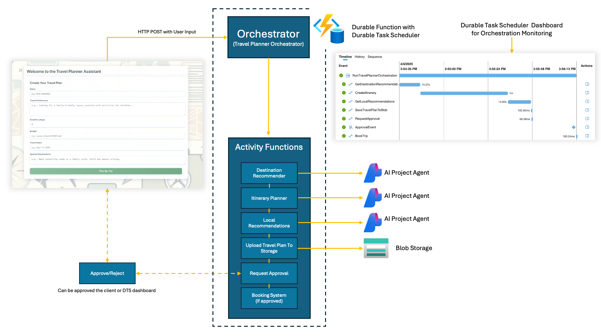

# AI Agent Orchestrator - Travel Planner

A sophisticated travel planning application that leverages the Microsoft Agent Framework and Azure Durable Functions to create comprehensive travel plans through a coordinated workflow of specialized AI agents.

## Overview

The AI Agent Orchestrator Travel Planner demonstrates an agentic workflow using specialized AI agents built with the [Microsoft Agent Framework](https://github.com/microsoft/agent-framework) and coordinated by Azure Durable Functions to create personalized travel experiences. Each agent specializes in a specific aspect of travel planning, working together to produce a comprehensive travel plan that users can review and approve.

## Architecture



### Components

1. **Frontend Interface**: React-based web application for user interaction
2. **HTTP Trigger API**: Entry point for client requests
3. **Durable Functions Orchestrator**: Coordinates the workflow between specialized agents
4. **Specialized AI Agents** (built with Microsoft Agent Framework):
   - Destination Recommender Agent
   - Itinerary Planner Agent
   - Local Recommendations Agent
5. **Blob Storage**: Stores generated travel plans
6. **Approval System**: Human-in-the-loop verification before booking

## Microsoft Agent Framework

This application uses the **Microsoft Agent Framework**, the next-generation unified framework that combines the best of Semantic Kernel and AutoGen. The framework provides:

- **Simplified Agent Creation**: Build agents with minimal boilerplate using `ChatClientAgent`
- **Flexible Model Support**: Works with Azure OpenAI, OpenAI, and other providers via `IChatClient`
- **Built-in Orchestration**: Compose agents into workflows with explicit control
- **Production Ready**: Enterprise-grade features including telemetry, hosting, and state management

For more information:
- [Framework Introduction](https://devblogs.microsoft.com/dotnet/introducing-microsoft-agent-framework-preview/)
- [Framework Documentation](https://learn.microsoft.com/en-us/agent-framework/overview/agent-framework-overview)
- [Migration Guide](./MIGRATION_GUIDE.md) - Details on migrating from Azure.AI.Projects

## Why Agentic Workflow with Durable Functions?

Travel planning inherently follows a structured sequence - selecting destinations, crafting itineraries, and gathering local insights, making it ideal for an agentic workflow with pre-defined steps, rather than self-directed agent exploration. This approach provides greater determinism and predictability in results, ensuring consistent high-quality travel plans with each execution. While autonomous agents excel at unpredictable, creative tasks, they can be inefficient and inconsistent for well-defined processes like travel planning that benefit from structured, predictable workflows.

The agentic workflow interacts with specialized (sub) agents at the first three stages:

1. A **destination recommender agent** provides global knowledge across thousands of locations
2. A **itinerary planner agent** creates a daily itinerary based on a deep understanding of a specific destination's logistics and seasonal considerations
3. A **local recommendations agent** provides popular attractions to visit

By using Durable Functions to coordinate specialized agents, the travel agent can create a more accurate and comprehensive travel plan than a single generalist agent. Once the travel plan has been created, Durable Function orchestrations provide built-in support for human interaction. In this case, it allows for human approval of the travel plan before proceeding to book the trip.

Seeking this approval can be a long-running operation that may encounter failures along the way. However, by leveraging Durable Functions, the application benefits from resiliency through built-in state persistence, ensuring the orchestration can resume in the event of a failure, such as a downstream dependency outage.

## How the Application Works

### Step 1: User Request

The user fills out a travel request form with preferences, budget, and other requirements in the React frontend application.

### Step 2: HTTP Trigger Invocation

The request is sent to an HTTP-triggered Azure Function that starts a new Durable Functions orchestration instance.

### Step 3: Destination Recommendation

The orchestrator invokes the Destination Recommender Agent activity, which analyzes the user's preferences and suggests the most suitable destinations.

### Step 4: Itinerary Planning

Once destinations are selected, the orchestrator invokes the Itinerary Planner Agent activity to create a detailed day-by-day plan tailored to the chosen location.

### Step 5: Local Recommendations

The orchestrator invokes the Local Recommendations Agent activity to enhance the itinerary with insider tips, hidden gems, and popular attractions.

### Step 6: Travel Plan Storage

The complete travel plan is saved to Azure Blob Storage, and a document URL is generated for user access.

### Step 7: Approval Request

The travel plan is presented to the user for approval via the frontend interface.

### Step 8: Booking Process (Conditional)

If approved, the orchestrator proceeds with the booking process. If rejected, it can either terminate or restart with modified preferences.

### Step 9: Confirmation

Upon successful booking, the user receives a final confirmation with all travel details.

## Prerequisites

- Docker
- .NET 8 SDK
- Azure Functions Core Tools v4
- Node.js 16+ and npm
- Azure Developer CLI (azd)
- Azure Subscription with:
  - Azure Functions resource
  - Azure Storage Account
  - Azure Durable Task resource
  - Azure OpenAI or Azure AI Inference endpoint

## Setting Up Locally

### 1. Clone the Repository

```bash
git clone https://github.com/yourusername/AiAgentOrchestrator.git
cd AiAgentOrchestrator
```

### 2. Configure Environment Variables

Create a `local.settings.json` file in the root directory with the following content:

```json
{
  "IsEncrypted": false,
  "Values": {
    "AzureWebJobsStorage": "UseDevelopmentStorage=true",
    "FUNCTIONS_WORKER_RUNTIME": "dotnet-isolated",
    "DURABLE_TASK_SCHEDULER_CONNECTION_STRING": "Endpoint=http://localhost:32768;Authentication=None",
    "TASKHUB_NAME": "default",
    "AZURE_OPENAI_ENDPOINT": "https://<your-endpoint>.openai.azure.com/",
    "AZURE_OPENAI_DEPLOYMENT_NAME": "gpt-4o-mini"
  },
  "Host": {
    "LocalHttpPort": 7071,
    "CORS": "*",
    "CORSCredentials": false
  }
}
```

**Key Configuration:**
- `AZURE_OPENAI_ENDPOINT`: Your Azure OpenAI endpoint URL
- `AZURE_OPENAI_DEPLOYMENT_NAME`: The model deployment name (e.g., "gpt-4o-mini", "gpt-4")

**Authentication:** The application uses `DefaultAzureCredential` which automatically handles authentication:
- **Local development**: Uses Azure CLI (`az login`) or VS Code authentication
- **Azure deployment**: Uses the Function App's managed identity

Make sure you're logged in locally with `az login` before running the application.

### 3. Set Up Azure Storage Emulator

For local development, install and start Azurite:

```bash
# If using Azurite via npm
npm install -g azurite
azurite
```

### 4. Run the Durable Task Scheduler Locally

```bash
docker run -itP mcr.microsoft.com/dts/dts-emulator:latest
```

### 5. Run Backend Functions

Start the Azure Functions project in the root directory:

```bash
func start
```

### 6. Run Frontend Application

Open a new terminal window and navigate to the Frontend directory:

```bash
cd Frontend
npm install
npm start
```

The application will be accessible at `http://localhost:3000`

## Deploying to Azure

### 1. Prerequisites

Ensure you have Azure Developer CLI (azd) installed:

#### Windows

```PowerShell
winget install microsoft.azd
azd version
```

#### Mac

```bash
brew tap azure/azd && brew install azd
azd version
```

#### Linux

```bash
curl -fsSL https://aka.ms/install-azd.sh | bash
azd version
```

Login to your Azure account:

```bash
azd auth login
```

### 2. Initialize Azure Resources

Initialize the Azure Developer CLI in your project:

```bash
azd init
```

Follow the prompts to configure your environment settings.

### 3. Provision Resources and Deploy

Use the Azure Developer CLI to provision all necessary resources and deploy your application:

```bash
azd up
```

This command will:

- Create all required Azure resources as defined in your infrastructure files
- Build the backend Azure Functions
- Build and deploy the frontend React application
- Configure all connections between components

### 4. Configure AI Agents

After deployment, you'll need to set up the three AI agents in Azure AI Projects:

#### Destination Recommender Agent

**System Prompt Example:**

```text
You are a destination recommendation expert that helps travelers find ideal 
vacation spots based on their preferences, budget, and travel dates. 
Analyze the user's preferences carefully and suggest 1-3 destinations 
with a brief explanation of why each is suitable. 
```

#### Itinerary Planner Agent

**System Prompt Example:**

```text
You are an itinerary planning expert that creates detailed day-by-day travel plans.
Generate a comprehensive itinerary for the requested destination including 
accommodations, activities, transportation, and estimated costs. 
```

#### Local Recommendations Agent

**System Prompt Example:**

```text
You are a local guide expert that provides insider knowledge about destinations.
Focus on both popular and hidden gem attractions, dining options across different
price ranges, and practical local tips that tourists wouldn't typically know.
```

### 5. Update Configuration

Update your application settings with the proper agent connection strings and IDs:

```bash
azd env set DESTINATION_RECOMMENDER_AGENT_ID "your-agent-id"
azd env set ITINERARY_PLANNER_AGENT_ID "your-agent-id"
azd env set LOCAL_RECOMMENDATIONS_AGENT_ID "your-agent-id"
azd env set DESTINATION_RECOMMENDER_CONNECTION "your-connection-string"
azd env set ITINERARY_PLANNER_CONNECTION "your-connection-string"
azd env set LOCAL_RECOMMENDATIONS_CONNECTION "your-connection-string"

# Apply these changes to your Azure resources
azd provision
```

### 6. Deploy React Web App

Update your `.env.production` file in `Frontend` directory so that it points to the correct API endpoint.

#### Bash

```bash
STATIC_WEB_APP_URI=$(azd env get-value STATIC_WEB_APP_URI)
echo "REACT_APP_API_URL=$STATIC_WEB_APP_URI/api" > ./Frontend/.env.production

# Redeploy the build bundle. 
azd package web
azd deploy web
```

#### PowerShell

```PowerShell
$staticWebAppUri = azd env get-value STATIC_WEB_APP_URI
"REACT_APP_API_URL=$staticWebAppUri/api" | Out-File -FilePath "./Frontend/.env.production" -Encoding utf8

# Redeploy the build bundle. 
azd package web
azd deploy web
```

## Clean up

Once you've finished your testing, clean up and remove resources to save on costs.

```bash
azd down --purge
```

## Learn More

- [Azure Durable Task Scheduler](https://learn.microsoft.com/en-us/azure/azure-functions/durable/durable-task-scheduler/quickstart-durable-task-scheduler?pivots=csharp)
- [Azure Durable Functions Documentation](https://docs.microsoft.com/en-us/azure/azure-functions/durable/durable-functions-overview)
- [Azure AI Projects Documentation](https://learn.microsoft.com/en-us/azure/ai-studio/how-to/projects-sdk-overview)
- [Azure Functions Isolated Process Model](https://docs.microsoft.com/en-us/azure/azure-functions/dotnet-isolated-process-guide)
- [Azure Developer CLI Documentation](https://learn.microsoft.com/en-us/azure/developer/azure-developer-cli/)
- [Azurite Emulator](https://learn.microsoft.com/en-us/azure/storage/common/storage-use-azurite?tabs=visual-studio%2Cblob-storage)

## Contributing

Contributions are welcome! Please feel free to submit a Pull Request.

## License

This project is licensed under the MIT License - see the LICENSE file for details.
