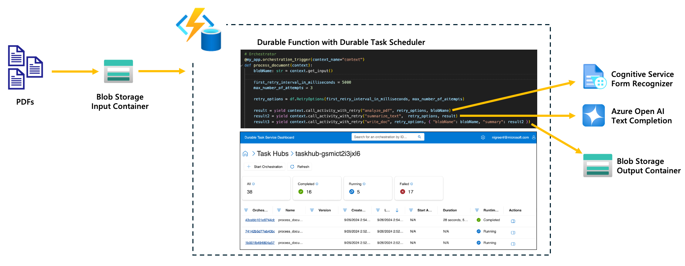
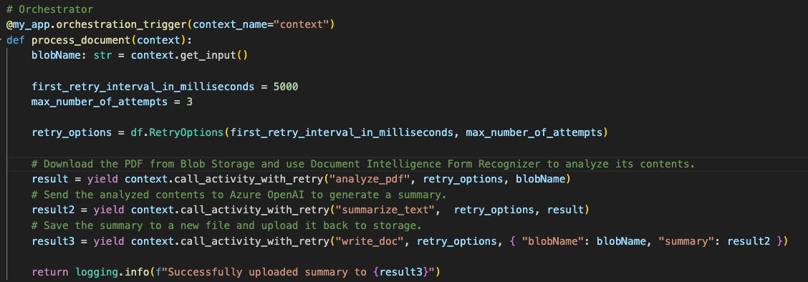
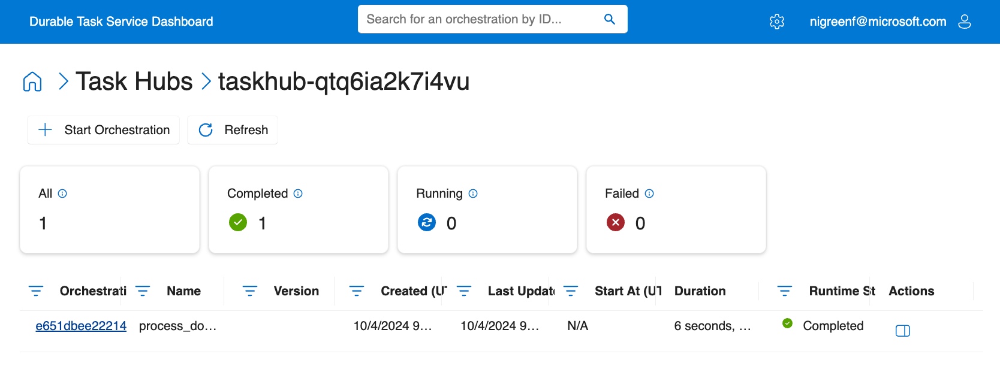
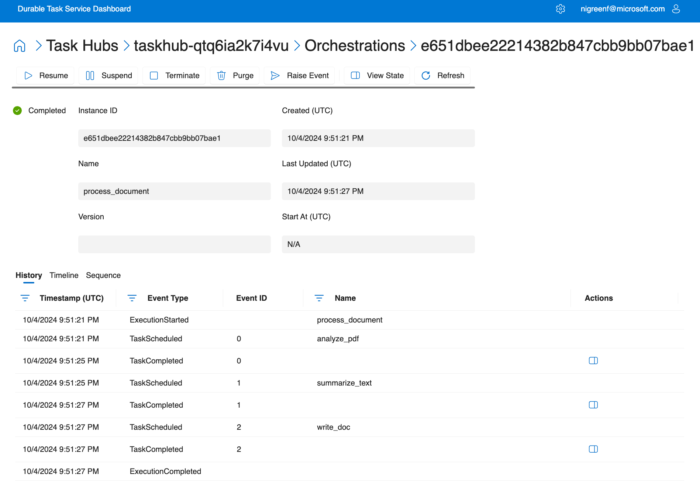
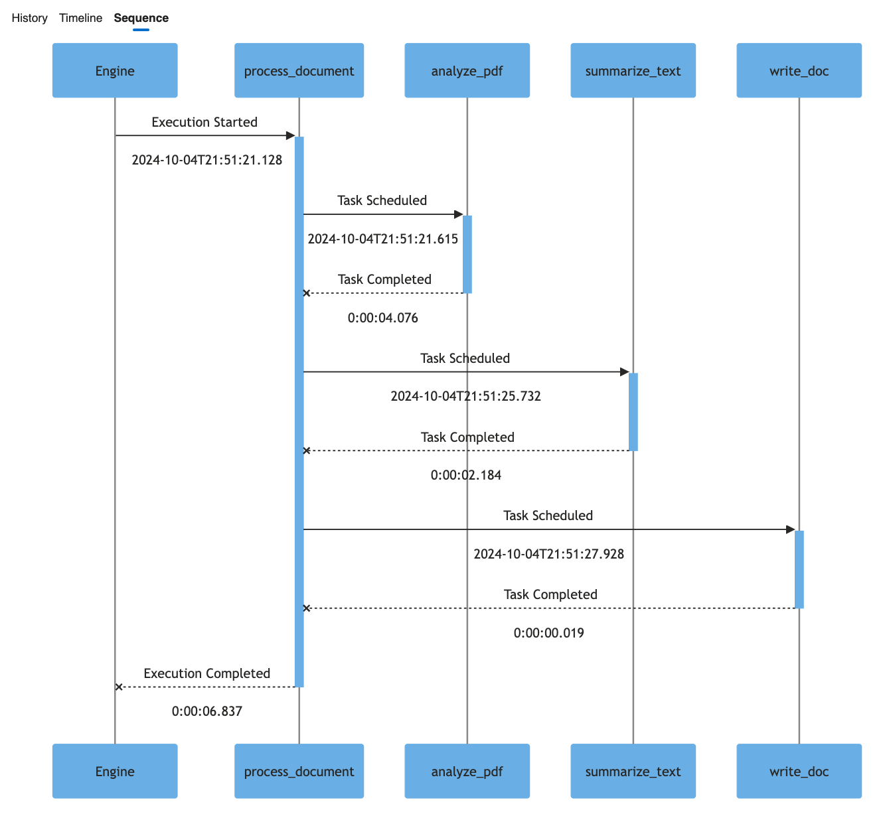

# Intelligent PDF Summarizer - Python
The purpose of this sample application is to demonstrate how Durable Functions can be leveraged to create intelligent applications, particularly in a document processing scenario. Order and durability are key here because the results from one activity are passed to the next. Also, calls to services like Cognitive Service or LLMs are costly and should not be repeated in the event of failures.

This sample integrates various Azure services, including the new Durable Task Scheduler for Azure Durable Functions, Azure Storage, Azure Cognitive Services, and Azure Open AI.

The application showcases how PDFs can be ingested and intelligently scanned to determine their content.



The application's workflow is as follows:
1.	PDFs are uploaded to a blob storage input container.
2.	A durable function is triggered upon blob upload.
3.	The Durable Task Scheduler for Azure Durable Functions schedules an orchestration that:
- - Downloads the blob (PDF).
- - Utilizes the Azure Cognitive Service Form Recognizer endpoint to extract the text from the PDF.
- - Sends the extracted text to Azure Open AI to analyze and determine the content of the PDF.
- - Save the summary results from Azure Open AI to a new file and upload it to the output blob container.

This sample uses **managed identity** for all Azure service connections and does **not** require public access to the storage account, making it compliant with enterprise security policies.

## Prerequisites

1. [Python 3.9+](https://www.python.org/downloads/)
2. [Create an active Azure subscription](https://learn.microsoft.com/en-us/azure/guides/developer/azure-developer-guide#understanding-accounts-subscriptions-and-billing).
3. [Install the latest Azure Functions Core Tools to use the CLI](https://learn.microsoft.com/en-us/azure/azure-functions/functions-run-local)
4. [Install Azure Developer CLI (azd)](https://aka.ms/azd) for deployment

## Deploy the app to Azure

The recommended way to get started is to deploy the app to Azure first using `azd`, which will provision all required Azure resources. After deployment, you can optionally run and test the app locally.

Use the [Azure Developer CLI (`azd`)](https://aka.ms/azd) to deploy the app. This will provision all necessary Azure services including:
- Durable Task Scheduler with taskhub
- Storage Account (with managed identity access, no public access required)
- Azure OpenAI
- Azure Cognitive Services (Document Intelligence)
- Function App with managed identity

1. In the root of the project, run the following command to provision and deploy the app:

    ```bash
    azd up
    ```

2. When prompted, provide:
   - A name for your [Azure Developer CLI environment](https://learn.microsoft.com/en-us/azure/developer/azure-developer-cli/faq#what-is-an-environment-name).
   - The Azure subscription you'd like to use.
   - The Azure location to use.

   > **Note:** At the moment, the Durable Task Scheduler can only be deployed to `West US2` and `NorthCentral US`. Unfortunately, the AZD CLI does not support `North Central US` and Azure Open AI does not support `West US2`. The best way to navigate discrepancies is to select `West US2` as your AZD location and hardcode the `openAi` module location to a region like `East US2`.

Once the azd up command finishes, the app will have successfully provisioned and deployed. 

## Running the app locally (Optional)

If you want to run the app locally after deploying to Azure, follow these steps:

### Prerequisites for local development
- [Start and configure an Azurite storage emulator for local storage](https://learn.microsoft.com/azure/storage/common/storage-use-azurite).

### local.settings.json
You will need to configure a `local.settings.json` file at the root of the repo that looks similar to the below. After running `azd up`, you can retrieve these values from the Azure portal or by running `azd env get-values`.

```json
{
  "Values": {
    "AzureWebJobsStorage": "UseDevelopmentStorage=true",
    "AzureWebJobsFeatureFlags": "EnableWorkerIndexing",
    "FUNCTIONS_WORKER_RUNTIME": "python",
    "DURABLE_TASK_SCHEDULER_CONNECTION_STRING": "Endpoint=<DTS-SCHEDULER-ENDPOINT>;Authentication=DefaultAzure",
    "TASKHUB_NAME": "<TASKHUB-NAME>",
    "STORAGE_ACCOUNT_NAME": "<STORAGE-ACCOUNT-NAME>",
    "COGNITIVE_SERVICES_ENDPOINT": "<COGNITIVE-SERVICE-ENDPOINT>",
    "AZURE_OPENAI_ENDPOINT": "<AZURE-OPEN-AI-ENDPOINT>",
    "CHAT_MODEL_DEPLOYMENT_NAME": "<AZURE-OPEN-AI-MODEL>"
  }
}
```

### Running locally

1. Start Azurite: Begin by starting Azurite, the local Azure Storage emulator.

2. Install the Requirements: Open your terminal and run the following command to install the necessary packages:

    ```bash
    python3 -m pip install -r requirements.txt
    ```

3. Install the Durable Task Scheduler Extension Packages: Execute the following commands to install the required Durable Task Scheduler extension packages:

    ```bash
    func extensions install --package Microsoft.Azure.WebJobs.Extensions.DurableTask.AzureManaged --version 0.3.0-alpha
    ```

    ```bash
    func extensions install --package Microsoft.Azure.WebJobs.Extensions.DurableTask --version 2.13.7
    ```

4. Start the Function App: Start the function app to run the application locally.

    ```bash
    func start --verbose
    ```

## Inspect the code

This app leverages Durable Functions to orchestrate the application workflow. By using Durable Functions, there's no need for additional infrastructure like queues and state stores to manage task coordination and durability, which significantly reduces the complexity for developers. 

Take a look at the code snippet below, the `process_document` defines the entire workflow, which consists of a series of steps (activities) that need to be scheduled in sequence. Coordination is key, as the output of one activity is passed as an input to the next. Additionally, Durable Functions handle durability and retries, which ensure that if a failure occurs, such as a transient error or an issue with a dependent service, the workflow can recover gracefully.



## Using the app
To use the app, simply upload a PDF to the Blob Storage `input` container. You can use [Azure Storage Explorer](https://azure.microsoft.com/features/storage-explorer/) to connect to your storage account using your Azure AD credentials (no connection strings or SAS tokens required). Once the PDF is uploaded, it will be processed using document intelligence and Azure OpenAI. The resulting summary will be saved to a new file and uploaded to the `output` container.

### Review Execution History in the Durable Task Scheduler Dashboard
Since the application leverages the Durable Task Scheduler backend storage provider for Durable Functions, all orchestration executions are persisted and can be viewed in the monitoring and management dashboard.



This dashboard enables you to monitor the status of ongoing and failed orchestrations, and troubleshoot any issues causing orchestrations to fail or become "stuck." It also displays the outputs from each activity execution. Additionally, you can use the timeline and sequence diagrams to gain insights into the orchestration execution, including the duration of each activity.



