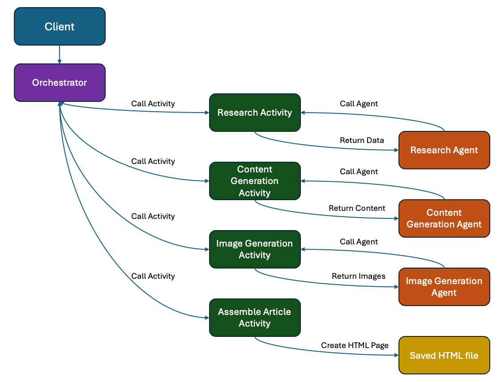
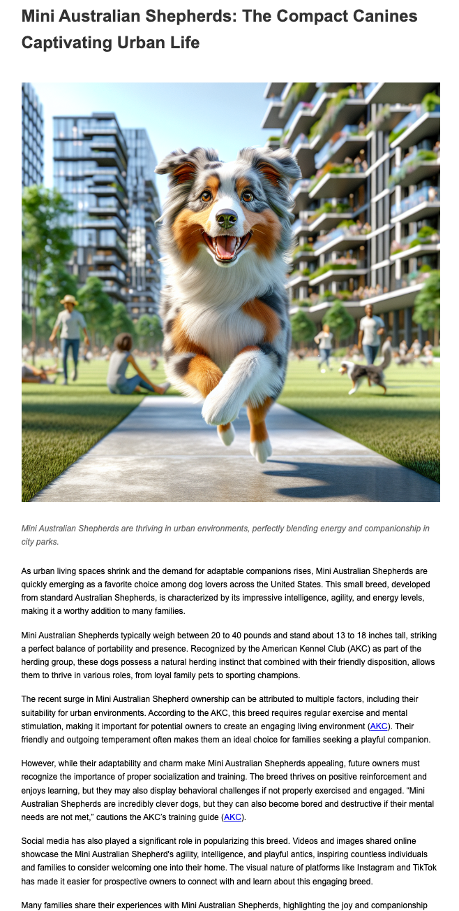

# Agent Chaining Sample with Durable Task SDK for .NET

This sample demonstrates how to implement an AI-powered news article generator workflow using the Durable Task .NET SDK, Azure AI Projects, persistent agents, and DALL-E image generation. The workflow chains multiple specialized agents together to research a topic, generate content, create images, and assemble everything into a final HTML article that's saved to the project's `/tmp/` directory.

## Table of Contents
- [Overview](#overview)
- [Architecture](#architecture)
- [Prerequisites](#prerequisites)
- [Running the Sample Locally](#running-the-sample-locally)
- [Implementation Details](#implementation-details)
- [Workflow Steps](#workflow-steps)
- [Directory Structure](#directory-structure)
- [Environment Variables](#environment-variables)
- [Authentication](#authentication)
- [View Orchestrations in the Dashboard](#view-orchestrations-in-the-dashboard)
- [Learn More](#learn-more)

## Overview

This sample implements a news article generator workflow that chains together three specialized AI agents using the Azure AI Projects service:

1. **Research Agent**: Researches a given topic using persistent agent capabilities
2. **Content Generation Agent**: Creates article content based on research findings
3. **Image Generation Agent**: Generates relevant feature and supporting images for the article using DALL-E (with Microsoft Entra ID authentication)

The workflow is coordinated by a durable orchestration that passes outputs from one agent to the next, eventually combining all results into a comprehensive HTML article that's saved to the project's `/tmp/` directory. The sample demonstrates how to use Microsoft Entra ID authentication with DefaultAzureCredential for secure access to Azure AI services and demonstrates agent chaining patterns using the Durable Task SDK.

## Architecture

The following diagram illustrates the flow of the news article generator workflow:



### Components

- **Orchestrator**: Coordinates the workflow between specialized agents using Durable Task SDK
- **Activities**: Interface with the agents through their respective services
- **Agent Services**: Make calls to Azure AI Projects service for persistent agents
- **DALL-E Integration**: Generates feature and supporting images using Azure OpenAI's DALL-E 3 model with Microsoft Entra ID authentication (optional component)
- **Models**: Define the data structures for the workflow and results

## Prerequisites

- [.NET 8 SDK](https://dotnet.microsoft.com/download/dotnet/8.0)
- [Docker](https://www.docker.com/products/docker-desktop/) (for running the Durable Task Scheduler emulator)
- Azure AI Projects service with Persistent Agents capability
- Azure credentials with access to Azure AI Projects service (DefaultAzureCredential)
- Optional: Access to Azure OpenAI service with DALL-E 3 deployment and Microsoft Entra ID authentication configured

## Running the Sample Locally

### 1. Set Up the Durable Task Scheduler Emulator

```bash
# Pull the emulator image
docker pull mcr.microsoft.com/dts/dts-emulator:latest

# Run the emulator
docker run --name dtsemulator -d -p 8080:8080 -p 8082:8082 mcr.microsoft.com/dts/dts-emulator:latest

# Wait a few seconds for the container to be ready
```

### 2. Clone the Repository and Navigate to the Sample Directory

```bash
git clone https://github.com/Azure-Samples/Durable-Task-Scheduler.git
cd Durable-Task-Scheduler/samples/durable-task-sdks/dotnet/Agents/PromptChaining
```

### 3. Configure Environment Variables

Create a `.env` file or set environment variables:

```bash
# Required: Azure AI Projects endpoint for agent creation
export AGENT_CONNECTION_STRING="https://your-ai-project-endpoint.services.ai.azure.com/api/projects/your-ai-project-endpoint"

# Optional: OpenAI deployment name (defaults to "gpt-4" if not specified)
export OPENAI_DEPLOYMENT_NAME="gpt-4-turbo" # or any other model deployment name in your Azure OpenAI resource

# Optional: DALL-E API endpoint for image generation with Microsoft Entra ID authentication
# IMPORTANT: This is a different endpoint from your AI Projects endpoint - it's your Azure OpenAI resource
# It must include your deployment name (e.g., dall-e-3) and API version in the URL
# If not provided, the app will use placeholder images instead
export DALLE_ENDPOINT="https://your-resource.openai.azure.com/openai/deployments/dall-e-3/images/generations?api-version=2024-02-01"

# Authentication is handled using DefaultAzureCredential (az login, managed identity, etc.)

# Optional: Custom Durable Task Scheduler connection string (default is local emulator)
export DTS_CONNECTION_STRING="Endpoint=http://localhost:8080;TaskHub=default;Authentication=None"
```

Note: If you're using Windows Command Prompt, use `set` instead of `export`:

```cmd
set AGENT_CONNECTION_STRING=https://your-ai-project-endpoint.services.ai.azure.com/api/projects/your-ai-project-endpoint
set OPENAI_DEPLOYMENT_NAME=gpt-4-turbo
set DALLE_ENDPOINT=https://your-resource.openai.azure.com/openai/deployments/dall-e-3/images/generations?api-version=2024-02-01
set DTS_CONNECTION_STRING=Endpoint=http://localhost:8080;TaskHub=default;Authentication=None
```

For PowerShell:

```powershell
$env:AGENT_CONNECTION_STRING="https://your-ai-project-endpoint.services.ai.azure.com/api/projects/your-ai-project-endpoint"
$env:OPENAI_DEPLOYMENT_NAME="gpt-4-turbo"
$env:DALLE_ENDPOINT="https://your-resource.openai.azure.com/openai/deployments/dall-e-3/images/generations?api-version=2024-02-01"
$env:DTS_CONNECTION_STRING="Endpoint=http://localhost:8080;TaskHub=default;Authentication=None"
```

### 4. Build the Project

```bash
dotnet build
```

### 5. Run the Worker

In one terminal window:

```bash
dotnet run --project Worker/Worker.csproj
```

### 6. Run the Client

In another terminal window:

```bash
dotnet run --project Client/Client.csproj
```

### 7. Enter a Topic for Article Generation

Follow the prompts in the client console to enter a news topic. The system will:
1. Research the topic using the Research Agent
2. Generate article content using the Content Generation Agent
3. Create images using the Image Generation Agent with DALL-E
4. Assemble and save the final HTML article to the `/tmp/` directory

The client will display the research findings, article content, image details, and the path to the saved HTML file.

## Implementation Details

### Solution Structure

This solution follows best practices for .NET applications:

- **Clean Architecture**: Separation of concerns with distinct layers
- **Dependency Injection**: All services are registered and resolved via the DI container
- **Modern .NET Patterns**: Uses .NET 8 features like minimal APIs and improved configuration
- **Central Package Management**: Uses Directory.Packages.props for consistent package versioning
- **New Solution Format**: Includes both traditional .sln and new .slnx formats

### Worker Project

The Worker project contains:
- **Orchestrations**: Coordinates the workflow using `ContentCreationOrchestration` class
  - Uses `TaskOrchestrator<TInput, TOutput>` base class for strong typing
  - Implements replay-safe logging via `context.CreateReplaySafeLogger()`
  - Uses `nameof()` for activity names to prevent typos
- **Activities**: Interfaces with agents through four activities:
  - `ResearchTopicActivity`: Researches the topic using the Research Agent
  - `CreateArticleActivity`: Generates article content using the Content Generation Agent
  - `GenerateImagesActivity`: Creates images using the Image Generation Agent and DALL-E
  - `AssembleFinalArticleActivity`: Assembles the final HTML article with content and images
- **Services**: 
  - `BaseAgentService`: Abstract base class for all agent services with common functionality
  - `ResearchAgentService`: Creates and uses an agent for topic research
  - `ContentGenerationAgentService`: Creates and uses an agent for article generation
  - `ImageGenerationAgentService`: Creates agent for image descriptions and integrates with DALL-E API
  - Uses `IHttpClientFactory` for proper HTTP connection management
  - Uses `using` statements for disposable resources like HttpClient and responses

### Client Project

The Client project:
- Connects to the Durable Task Scheduler using the provided connection string
- Takes user input for the news topic to research
- Starts the news article generation orchestration
- Waits for completion and displays the results in the console
- Shows research summary, article content, image details, and final article location

### Shared Project

Contains shared models and data structures used by both Worker and Client:
- `ContentCreationRequest`: Input for the orchestration
- `ContentWorkflowResult`: Complete workflow results
- `ResearchData`: Results from the research activity
- `GeneratedImage`: Image details from the image generation activity

## Workflow Steps

1. **Research Phase**:
   - The user provides a topic through the client console
   - The orchestration calls the `ResearchTopicActivity` 
   - The Research Agent (created with Azure AI Projects) processes the topic
   - Results include key facts, sources, summary, and potential article angles
   - All data is structured in JSON format

2. **Content Creation Phase**:
   - The orchestration passes the research data to the `CreateArticleActivity`
   - The Content Generation Agent creates professional news article content based on research
   - The article follows journalistic standards with proper HTML formatting

3. **Image Generation Phase**:
   - The orchestration passes the article content to the `GenerateImagesActivity`
   - The Image Generation Agent analyzes the article content and creates:
     - A feature image for the article header that captures the main theme
     - Supporting images that illustrate key points in the article
     - Detailed image descriptions and carefully crafted prompts for DALL-E
   - If DALL-E_ENDPOINT is configured:
     - The system calls the Azure OpenAI DALL-E API with Azure.Identity's DefaultAzureCredential
     - Images are generated using the DALL-E 3 model for professional quality visuals
   - If DALL-E_ENDPOINT is not configured:
     - Placeholder images are used instead with appropriate captions
   - All images include descriptions, DALL-E prompts, captions, and URLs for embedding

4. **Assembly Phase**:
   - The orchestration calls the `AssembleFinalArticleActivity` with article content and images
   - The final article is assembled with:
     - Complete HTML structure and styling
     - Article content with proper formatting
     - Strategically placed images with captions
     - Metadata section with generation details
   - The HTML file is saved to the project's `/tmp/` directory
   - File path and HTML content are returned to the client

   

## Directory Structure

```
PromptChaining/                 # Root directory for the sample
├── Client/                     # Client application
│   ├── Client.csproj          # Client project file
│   └── Program.cs             # Client code to start orchestrations
├── Shared/                     # Shared code between Client and Worker
│   ├── Models/
│   │   └── ContentModels.cs   # Shared data models
│   └── Shared.csproj          # Shared project file
├── Worker/                     # Worker application
│   ├── Activities/            # Activity implementations
│   │   └── ContentActivities.cs
│   ├── Orchestrations/        # Orchestration implementations
│   │   └── ContentCreationOrchestration.cs
│   ├── Services/              # Agent service implementations
│   │   ├── IAgentService.cs         # Base interface and implementation
│   │   ├── ResearchAgentService.cs  # Research agent implementation
│   │   ├── ContentGenerationAgentService.cs  # Content generation implementation
│   │   ├── ImageGenerationAgentService.cs    # Image generation implementation
│   │   ├── AgentServices.cs         # Contains common code
│   │   └── Models/                  # Service models
│   │       └── DalleModels.cs       # DALL-E API response models
│   ├── Program.cs             # Worker setup and configuration
│   └── Worker.csproj          # Worker project file
├── images/                     # Images used in documentation
│   ├── architecture.png
│   └── sample-article.png
├── Directory.Packages.props    # Central package management
├── AgentChainingSample.csproj  # Solution project file
├── AgentChainingSample.sln     # Traditional solution file
├── AgentChainingSample.slnx    # New slnx format solution file (recommended)
├── README.md                   # This readme file
└── tmp/                        # Directory where HTML files are saved (created at runtime)
```

## Environment Variables

The sample uses the following environment variables:

- `AGENT_CONNECTION_STRING`: (Required) The endpoint for your Azure AI Projects service
  - Format: `https://<resource-name>.services.ai.azure.com/api/projects/<project-id>`
- `OPENAI_DEPLOYMENT_NAME`: (Optional) The name of the OpenAI model deployment to use (defaults to "gpt-4" if not specified)
  - Example: "gpt-4", "gpt-4-turbo", "gpt-35-turbo"
- `DALLE_ENDPOINT`: (Optional) The complete endpoint URL for your Azure OpenAI DALL-E service
  - Format: `https://<resource-name>.openai.azure.com/openai/deployments/dall-e-3/images/generations?api-version=2024-02-01`
  - This is different from the AGENT_CONNECTION_STRING and points to your Azure OpenAI resource
- `DTS_CONNECTION_STRING`: (Optional) The complete connection string to the Durable Task Scheduler service (defaults to `Endpoint=http://localhost:8080;TaskHub=default;Authentication=None`)

Note: 
- If the DALL-E endpoint is not provided, the application will use placeholder images instead of generating real ones
- Authentication for both Azure AI Projects and DALL-E services uses DefaultAzureCredential
- No API keys are needed as the application uses Microsoft Entra ID for authentication
- The implementation defaults to the GPT-4 model if OPENAI_DEPLOYMENT_NAME is not specified

## Authentication

The sample uses Azure's DefaultAzureCredential for authenticating to both Azure AI Projects and Azure OpenAI services. No API keys are required as the application relies entirely on Microsoft Entra ID (formerly Azure AD) authentication.

DefaultAzureCredential tries these authentication methods in sequence:

1. Environment variables (`AZURE_CLIENT_ID`, `AZURE_TENANT_ID`, `AZURE_CLIENT_SECRET`)
2. Managed identities (when running in Azure)
3. Visual Studio, Visual Studio Code, and Azure CLI credentials
4. Interactive browser login (as a fallback)

For local development, the simplest approach is to authenticate with the Azure CLI:

```bash
# Login with your Azure account that has access to both 
# Azure AI Projects and Azure OpenAI services
az login

# If you have multiple subscriptions, ensure the correct one is selected
az account set --subscription "your-subscription-name-or-id"
```

Make sure your Azure identity has the following roles:
- For Azure AI Projects: "AI Project User" role
- For Azure OpenAI: "Cognitive Services OpenAI User" role

## View Orchestrations in the Dashboard

You can view the orchestration executions in the Durable Task Scheduler emulator dashboard:

1. Open a web browser and navigate to `http://localhost:8082`
2. Select the `default` task hub
3. Navigate to the Instances tab to see your orchestration instances

## Debugging Tips

### Debugging in Visual Studio Code

1. Open the project in VS Code
2. Configure launch settings in `.vscode/launch.json`:
   ```json
   {
     "version": "0.2.0",
     "configurations": [
       {
         "name": "Worker",
         "type": "coreclr",
         "request": "launch",
         "preLaunchTask": "build",
         "program": "${workspaceFolder}/Worker/bin/Debug/net8.0/AgentChainingSample.Worker.dll",
         "cwd": "${workspaceFolder}",
         "stopAtEntry": false,
         "env": {
           "AGENT_CONNECTION_STRING": "your-connection-string",
           "OPENAI_DEPLOYMENT_NAME": "gpt-4-turbo",
           "DALLE_ENDPOINT": "your-dalle-endpoint"
         }
       },
       {
         "name": "Client",
         "type": "coreclr",
         "request": "launch",
         "preLaunchTask": "build",
         "program": "${workspaceFolder}/Client/bin/Debug/net8.0/AgentChainingSample.Client.dll",
         "cwd": "${workspaceFolder}",
         "stopAtEntry": false,
         "env": {
           "DTS_CONNECTION_STRING": "Endpoint=http://localhost:8080;TaskHub=default;Authentication=None"
         }
       }
     ]
   }
   ```

### Common Issues

1. **Authentication Problems**: If you're seeing authentication errors, ensure:
   - You've run `az login` in your terminal
   - Your Azure account has access to the AI Projects and OpenAI resources
   - Your DALL-E endpoint URL is correctly formatted

2. **DALL-E Integration Issues**: If the application is using placeholder images instead of generating real ones:
   - Check if `DALLE_ENDPOINT` environment variable is correctly set
   - Verify the endpoint URL format (should include the deployment name and API version)
   - Ensure it points to your Azure OpenAI service, not the AI Projects endpoint
   - Confirm the URL format follows: `https://<resource-name>.openai.azure.com/openai/deployments/dall-e-3/images/generations?api-version=2024-02-01`
   - Make sure you have the "Cognitive Services OpenAI User" role on the Azure OpenAI resource
   - Check if your Azure OpenAI resource has DALL-E 3 enabled and deployed
   - Examine the console logs for specific authentication or permission error messages

## Learn More

- [Durable Task SDK for .NET](https://github.com/microsoft/durabletask-dotnet)
- [Durable Task Scheduler Documentation](https://learn.microsoft.com/azure/azure-functions/durable/durable-task-scheduler/quickstart-durable-task-scheduler?pivots=csharp)
- [Azure.AI.Projects SDK Documentation](https://learn.microsoft.com/dotnet/api/overview/azure/ai.projects-readme?view=azure-dotnet-preview)
- [Azure.AI.Agents.Persistent SDK Documentation](https://learn.microsoft.com/dotnet/api/overview/azure/ai.agents.persistent-readme)
- [Azure AI Project Service Documentation](https://learn.microsoft.com/azure/ai-services/ai-project/overview)
- [DefaultAzureCredential Documentation](https://learn.microsoft.com/dotnet/api/azure.identity.defaultazurecredential)
- [Azure OpenAI DALL-E Documentation](https://learn.microsoft.com/azure/ai-services/openai/dall-e-quickstart)
