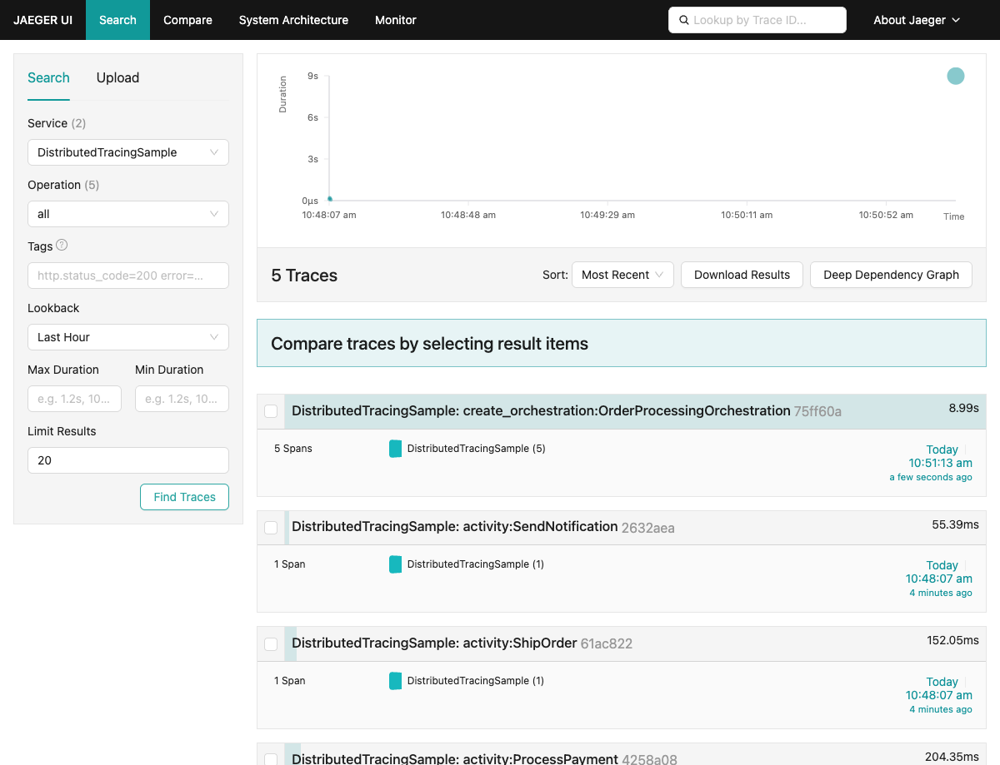
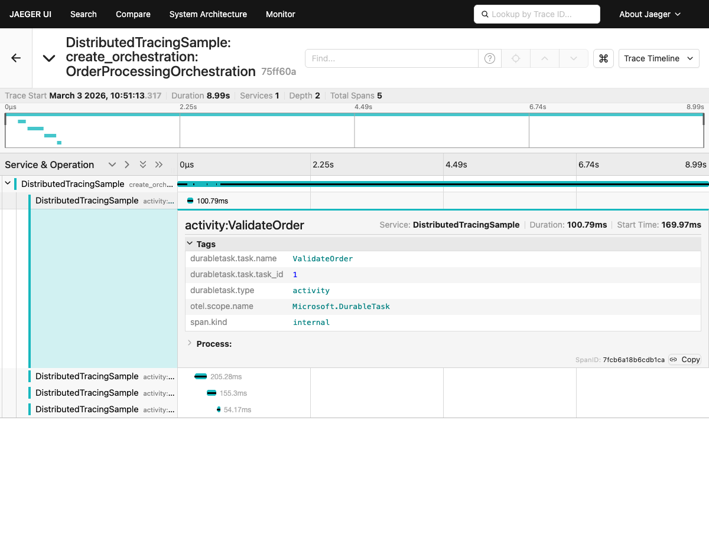

# OpenTelemetry Distributed Tracing

| | |
|-|-|
| **Language** | Java 21 |
| **SDK** | Durable Task SDK |

This sample shows how to wire up [OpenTelemetry](https://opentelemetry.io/) with the Durable Task SDK for Java to visualize orchestration flows in [Jaeger](https://www.jaegertracing.io/). It demonstrates trace correlation across an orchestrator and activities so you can see the full distributed trace of an order-processing workflow.

## Prerequisites

- [Java 21](https://learn.microsoft.com/java/openjdk/download)
- [Docker](https://www.docker.com/products/docker-desktop)

## Quick Run

### 1. Start the infrastructure (DTS emulator + Jaeger)

```bash
docker compose up -d
```

This launches:
- **DTS Emulator** on `localhost:8080` (gRPC) and `localhost:8082` (Dashboard)
- **Jaeger** on `localhost:16686` (UI), `localhost:4317` (OTLP gRPC), and `localhost:4318` (OTLP HTTP)

### 2. Run the sample

```bash
./gradlew run
```

This starts the worker, schedules an `OrderProcessingOrchestration`, and waits for it to complete.

## Viewing Traces

1. Open the Jaeger UI at **http://localhost:16686**
2. Select the **DistributedTracingSample** service from the dropdown
3. Click **Find Traces**
4. Click on the trace with **5 Spans** — you'll see the parent `create_orchestration:OrderProcessingOrchestration` with child activity spans nested underneath



Click on the trace to see the full span tree with parent-child hierarchy and rich `durabletask.*` tags:



You can also view the orchestration status in the DTS Dashboard at **http://localhost:8082**.

## What You'll See

The Jaeger UI shows a single trace for the entire orchestration with nested child spans for each activity. Each span includes `durabletask.task.name`, `durabletask.type`, and `durabletask.task.task_id` tags. This helps you:

- Identify slow activities within an orchestration
- See the sequential flow of function chaining
- Correlate the full orchestration lifecycle in one trace
- Debug failures with full context

## How It Works

The sample configures an OpenTelemetry `TracerProvider` with an OTLP/gRPC exporter that sends spans to Jaeger. Each activity creates a manual span using the tracer. The Durable Task SDK automatically propagates W3C trace context (`traceparent`/`tracestate`) when scheduling orchestrations, enabling end-to-end trace correlation.

Key configuration:

```java
OtlpGrpcSpanExporter spanExporter = OtlpGrpcSpanExporter.builder()
        .setEndpoint(otlpEndpoint)
        .build();

SdkTracerProvider tracerProvider = SdkTracerProvider.builder()
        .setResource(Resource.builder().put("service.name", "DistributedTracingSample").build())
        .addSpanProcessor(BatchSpanProcessor.builder(spanExporter).build())
        .build();

OpenTelemetrySdk.builder()
        .setTracerProvider(tracerProvider)
        .buildAndRegisterGlobal();
```

## Clean Up

```bash
docker compose down
```

## Learn More

- [Observability Guide](../../../../docs/observability.md)
- [OpenTelemetry Java docs](https://opentelemetry.io/docs/languages/java/)
- [Durable Task Scheduler Dashboard](https://learn.microsoft.com/azure/azure-functions/durable/durable-task-scheduler/durable-task-scheduler-dashboard)
