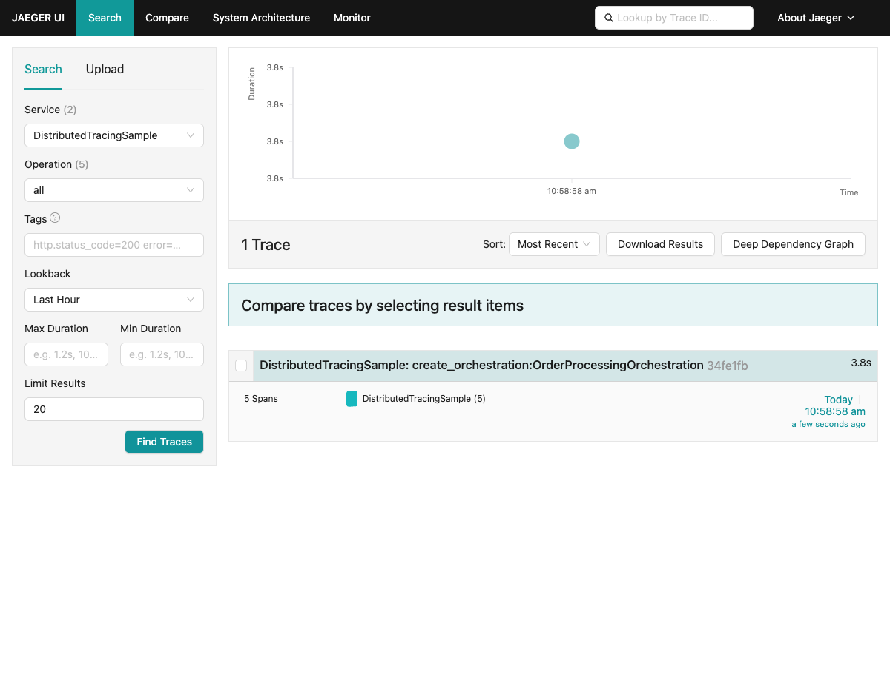
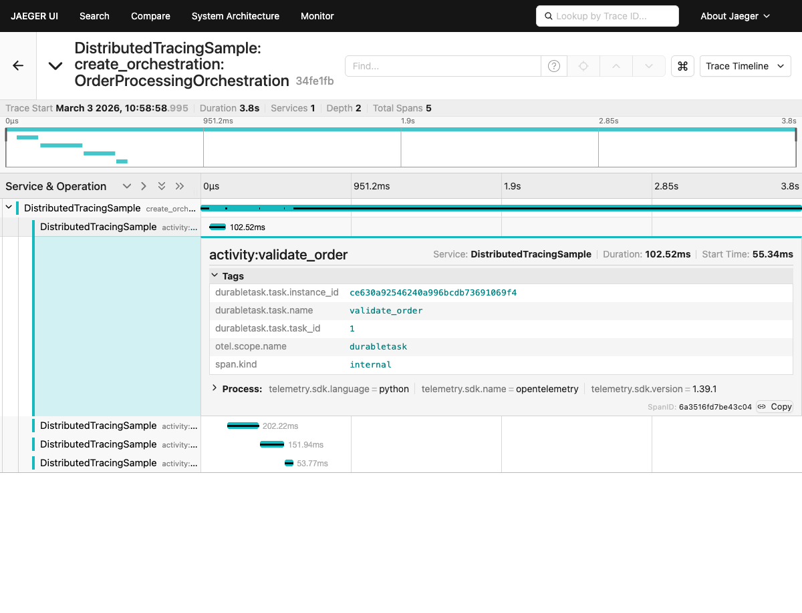

# OpenTelemetry Distributed Tracing

Python | Durable Task SDK

## Description

This sample demonstrates OpenTelemetry distributed tracing with the Durable Task SDK for Python. The SDK **automatically** creates activity spans with `durabletask.*` tags and propagates W3C trace context from orchestrations to activities — no manual span creation needed in your activity code.

## Prerequisites

1. [Python 3.9+](https://www.python.org/downloads/)
2. [Docker](https://www.docker.com/products/docker-desktop/)

## Quick Run

1. Start the infrastructure (emulator + Jaeger):
   ```bash
   docker compose up -d
   ```

2. Install dependencies and start the worker:
   ```bash
   python -m venv venv
   source venv/bin/activate  # Windows: venv\Scripts\activate
   pip install -r requirements.txt
   python worker.py
   ```

3. In a new terminal, run the client:
   ```bash
   source venv/bin/activate
   python client.py
   ```

4. View traces:
   - **Jaeger UI:** http://localhost:16686 (search for service `DistributedTracingSample`)
   - **DTS Dashboard:** http://localhost:8082

## Viewing Traces

Open the [Jaeger UI](http://localhost:16686), select the **DistributedTracingSample** service, and click **Find Traces**. You'll see a single trace with **5 Spans** — the parent `create_orchestration:OrderProcessingOrchestration` with 4 child activity spans:



Click on the trace to see the full span tree with parent-child hierarchy and rich `durabletask.*` tags (automatically added by the SDK):



## How It Works

The Durable Task Python SDK has **built-in OpenTelemetry support**:

1. **Client side**: When you schedule an orchestration with an active OpenTelemetry span, the SDK captures the W3C trace context (`traceparent`/`tracestate`) and sends it with the request.
2. **Orchestrator side**: The SDK stores the parent trace context and passes it to all child activities and sub-orchestrations.
3. **Activity side**: The SDK wraps each activity execution in an `activity:<name>` span as a child of the orchestration's trace context, with `durabletask.task.instance_id`, `durabletask.task.name`, and `durabletask.task.task_id` tags.

All you need is to configure a `TracerProvider` with an exporter — the SDK does the rest.

## What You'll See

The Jaeger UI shows a single trace for the entire orchestration with nested child spans for each activity. This helps you:

- Identify slow activities within an orchestration
- See the sequential flow of function chaining
- Correlate the full orchestration lifecycle in one trace
- Debug failures with full context

## Clean Up

```bash
docker compose down
```

## Learn More

- [Observability Guide](../../../../docs/observability.md)
- [OpenTelemetry Python docs](https://opentelemetry.io/docs/languages/python/)
- [Durable Task Scheduler Dashboard](https://learn.microsoft.com/azure/azure-functions/durable/durable-task-scheduler/durable-task-scheduler-dashboard)
