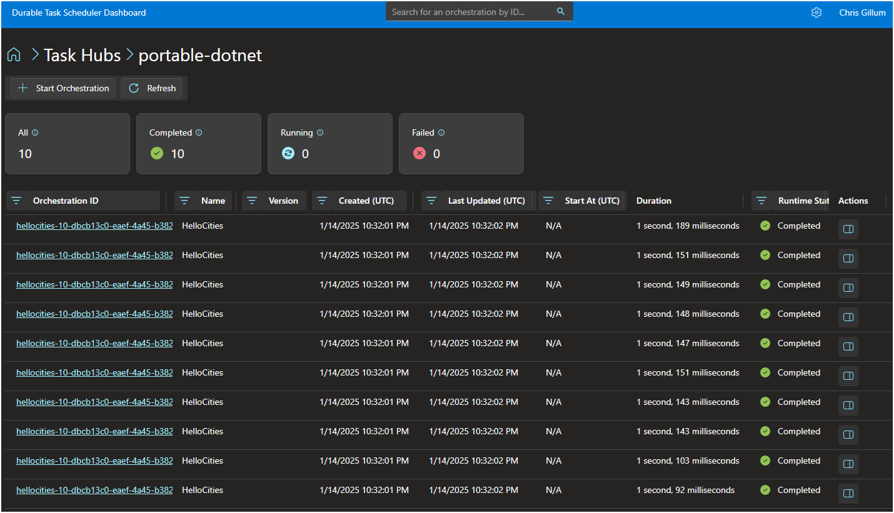

# Hello World with the Durable Task SDK for .NET

In addition to [Durable Functions](https://learn.microsoft.com/azure/azure-functions/durable/durable-functions-overview), the [Durable Task SDK for .NET](https://github.com/microsoft/durabletask-dotnet) can also use the durable task scheduler for managing orchestration state.

This directory includes a sample .NET console app that demonstrates how to use the scheduler with the Durable Task SDK for .NET (without any Azure Functions dependency).

## Prerequisites

- [.NET 8 SDK](https://dotnet.microsoft.com/download/dotnet/8.0)
- [Azure CLI](https://docs.microsoft.com/cli/azure/install-azure-cli)

## Creating a durable task scheduler task hub

Before you can run the app, you need to create a durable task scheduler task hub in Azure.

> **NOTE**: These are abbreviated instructions for simplicity. For a full set of instructions, see the Azure Durable Functions [QuickStart guide](../../../../quickstarts/HelloCities/README.md#create-a-durable-task-scheduler-namespace-and-task-hub).

1. Install the durable task scheduler CLI extension:

    ```bash
    az upgrade
    az extension add --name durabletask --allow-preview true
    ```

1. Create a resource group:

    ```bash
    az group create --name my-resource-group --location northcentralus
    ```

1. Create a durable task scheduler resource:

    **PowerShell**:

    ```powershell
    az durabletask scheduler create `
        --resource-group my-resource-group `
        --name my-scheduler `
        --ip-allowlist '["0.0.0.0/0"]' `
        --sku-name "Dedicated" `
        --sku-capacity 1
    ```

    **Bash**:

    ```bash
    az durabletask scheduler create \
        --resource-group my-resource-group \
        --name my-scheduler \
        --ip-allowlist '["0.0.0.0/0"]' \
        --sku-name "Dedicated" \
        --sku-capacity 1
    ```

1. Create a task hub within the scheduler resource:

    **PowerShell**:

    ```powershell
    az durabletask taskhub create `
        --resource-group my-resource-group `
        --scheduler-name my-scheduler `
        --name "durabletask-dotnet"
    ```

    **Bash**:

    ```bash
    az durabletask taskhub create \
        --resource-group my-resource-group \
        --scheduler-name my-scheduler \
        --name "durabletask-dotnet"
    ```

1. Grant the current user permission to connect to the `durabletask-dotnet` task hub:

    **PowerShell**:

    ```powershell
    $subscriptionId = az account show --query "id" -o tsv
    $loggedInUser = az account show --query "user.name" -o tsv

    az role assignment create `
        --assignee $loggedInUser `
        --role "Durable Task Data Contributor" `
        --scope "/subscriptions/$subscriptionId/resourceGroups/my-resource-group/providers/Microsoft.DurableTask/schedulers/my-scheduler/taskHubs/durabletask-dotnet"
    ```

    **Bash**:

    ```bash
    subscriptionId=$(az account show --query "id" -o tsv)
    loggedInUser=$(az account show --query "user.name" -o tsv)

    az role assignment create \
        --assignee $loggedInUser \
        --role "Durable Task Data Contributor" \
        --scope "/subscriptions/$subscriptionId/resourceGroups/my-resource-group/providers/Microsoft.DurableTask/schedulers/my-scheduler/taskHubs/durabletask-dotnet"
    ```

    Note that it may take a minute for the role assignment to take effect.

1. Generate a connection string for the scheduler and task hub resources and save it to the `DURABLE_TASK_SCHEDULER_CONNECTION_STRING` environment variable:

    **PowerShell**:

    ```powershell
    $endpoint = az durabletask scheduler show `
        --resource-group my-resource-group `
        --name my-scheduler `
        --query "properties.endpoint" `
        --output tsv
    $taskhub = "durabletask-dotnet"
    $env:DURABLE_TASK_SCHEDULER_CONNECTION_STRING = "Endpoint=$endpoint;TaskHub=$taskhub;Authentication=DefaultAzure"
    ```

    **Bash**:

    ```bash
    endpoint=$(az durabletask scheduler show \
        --resource-group my-resource-group \
        --name my-scheduler \
        --query "properties.endpoint" \
        --output tsv)
    taskhub="durabletask-dotnet"
    export DURABLE_TASK_SCHEDULER_CONNECTION_STRING="Endpoint=$endpoint;TaskHub=$taskhub;Authentication=DefaultAzure"
    ```

    The `DURABLE_TASK_SCHEDULER_CONNECTION_STRING` environment variable is used by the sample app to connect to the durable task scheduler resources. The type of credential to use is specified by the `Authentication` segment. Supported values include `DefaultAzure`, `ManagedIdentity`, `WorkloadIdentity`, `Environment`, `AzureCLI`, and `AzurePowerShell`.

## Running the sample

In the same terminal window as above, use the following steps to run the sample on your local machine.

1. Clone this repository.

1. Open a terminal window and navigate to the `samples/durabletask-sdk/dotnet/AspNetWebApp` directory.

1. Run the following command to build and run the sample:

    ```bash
    dotnet run
    ```

You should see output similar to the following:

```plaintext
2025-01-14T22:31:10.926Z info: Microsoft.DurableTask[1] Durable Task gRPC worker starting.
2025-01-14T22:31:11.041Z info: Microsoft.Hosting.Lifetime[14] Now listening on: http://localhost:5008
2025-01-14T22:31:11.042Z info: Microsoft.Hosting.Lifetime[0] Application started. Press Ctrl+C to shut down.
2025-01-14T22:31:11.043Z info: Microsoft.Hosting.Lifetime[0] Hosting environment: Development
2025-01-14T22:31:11.043Z info: Microsoft.Hosting.Lifetime[0] Content root path: /home/cgillum/code/github.com/Azure/Azure-Functions-Durable-Task-Scheduler-Private-Preview/samples/durabletask-sdk/dotnet/AspNetWebApp
2025-01-14T22:31:14.885Z info: Microsoft.DurableTask[4] Sidecar work-item streaming connection established.
```

Now, the ASP.NET Web API is running locally on your machine, and any output from the app will be displayed in the terminal window.

To run orchestrations, you can use a tool like [Postman](https://www.postman.com/) or [curl](https://curl.se/) in another terminal window to send a POST request to the `/scenarios/hellocities?count=N` endpoint, where `N` is the number of orchestrations to start.

```bash
curl -X POST "http://localhost:5008/scenarios/hellocities?count=10"
```

You should then see output in the ASP.NET Web App terminal window showing the logs associated with the orchestrations that were started.

## View orchestrations in the dashboard

You can view the orchestrations in the Durable Task Scheduler dashboard by navigating to the scheduler-specific dashboard URL in your browser.

Use the following PowerShell command from a new terminal window to get the dashboard URL:

**PowerShell**:

```powershell
$dashboardUrl = az durabletask taskhub show `
    --resource-group "my-resource-group" `
    --scheduler-name "my-scheduler" `
    --name "durabletask-dotnet" `
    --query "properties.dashboardUrl" `
    --output tsv
$dashboardUrl
```

**Bash**:

```bash
dashboardUrl=$(az durabletask taskhub show \
    --resource-group "my-resource-group" \
    --scheduler-name "my-scheduler" \
    --name "durabletask-dotnet" \
    --query "properties.dashboardUrl" \
    --output tsv)
echo $dashboardUrl
```

The URL should look something like the following:

```plaintext
https://dashboard.durabletask.io/subscriptions/{subscriptionID}/schedulers/my-scheduler/taskhubs/durabletask-dotnet?endpoint=https%3a%2f%2fmy-scheduler-gvdmebc6dmdj.northcentralus.durabletask.io
```

Once logged in, you should see the orchestrations that were created by the sample app. Below is an example of what the dashboard might look like (note that some of the details will be different than the screenshot):



## Optional: Deploy to Azure Container Apps

1. Create an container app following the instructions in the [Azure Container App documentation](https://learn.microsoft.com/azure/container-apps/get-started?tabs=bash).
1. During step 1, specify the deployed container app code folder at samples\durabletask-sdk\dotnet\AspNetWebApp
1. Follow the instructions to create a user managed identity and assign the `Durable Task Data Contributor` role then attach it to the container app you created in step 1 at [Azure-Functions-Durable-Task-Scheduler-Private-Preview](..\..\..\..\docs\configure-existing-app.md#run-the-app-on-azure-net). Please skip section "Add required environment variables to app" since these environment variables are not required for deploying to container app.
1. Call the container app endpoint at `http://sampleapi-<your-container-app-name>.azurecontainerapps.io/scenarios/hellocities?count=10`, Sample curl command:

    ```bash
    curl -X POST "https://sampleapi-<your-container-app-name>.azurecontainerapps.io/scenarios/hellocities?count=10"
    ```

1. You should see the orchestration created in the Durable Task Scheduler dashboard.
